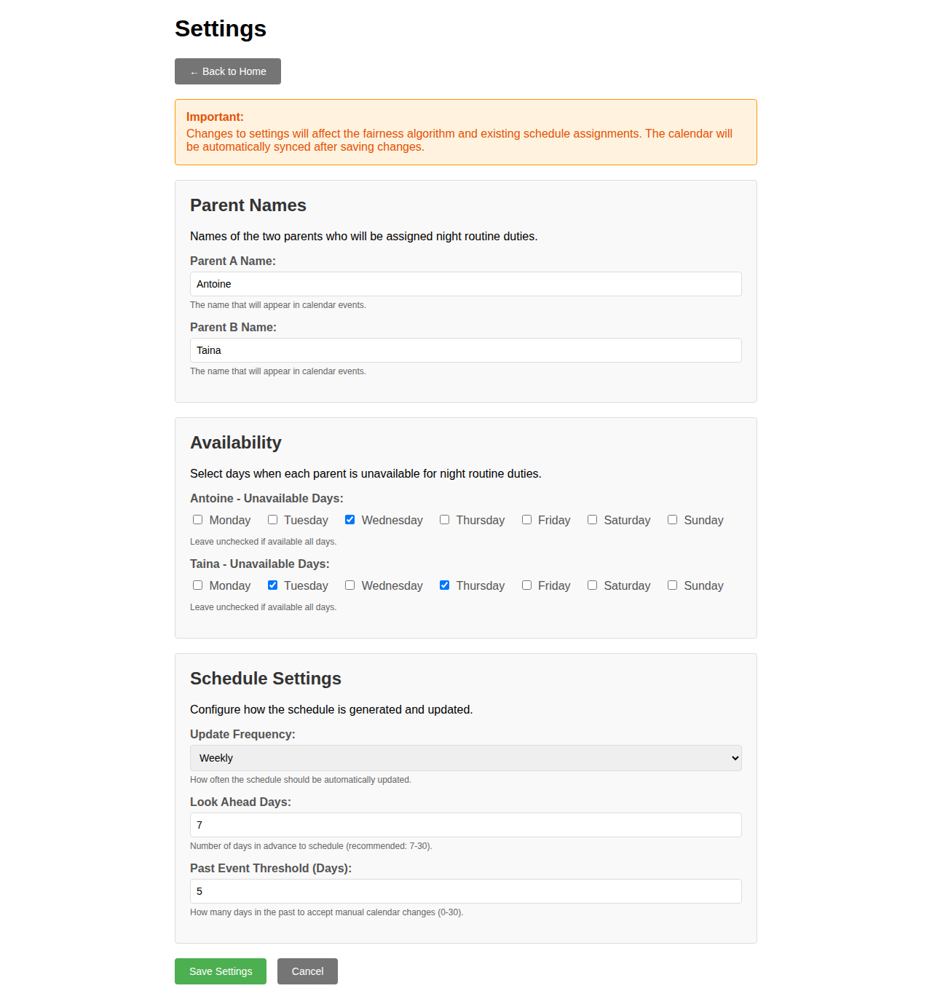

# Night Routine Scheduler

A Go application that manages night routine scheduling between two parents, with Google Calendar integration for automated event creation.

## Why?

Managing night routine duties between parents can be challenging. This application automates the scheduling process with a sophisticated fairness algorithm that considers multiple factors:

- **Fair distribution** - Balances total assignments and recent patterns
- **Availability awareness** - Respects each parent's unavailable days
- **Transparency** - Every assignment includes a clear decision reason
- **Flexibility** - Supports manual overrides when life happens
- **Google Calendar integration** - Seamlessly syncs with your existing calendar workflow

The application ensures both parents share night routine duties fairly while maintaining flexibility for real-world scheduling needs.

## Key Features

### Configuration Management

- **Web-Based Settings UI** - Intuitive interface for managing all runtime configuration
  - Configure parent names that appear in calendar events
  - Set availability constraints for each parent
  - Adjust schedule frequency and planning horizon
  - Changes take effect immediately without application restart

- **Database-Backed Configuration** - Settings stored in SQLite database
  - Persistent across application restarts
  - Atomic transactions ensure consistency
  - Database constraints validate data integrity
  - Automatic backup and migration support

- **Automatic Sync** - Settings changes trigger immediate calendar synchronization
  - Schedule recalculates based on new constraints
  - Calendar events updated automatically
  - Fairness algorithm adjusts to new availability patterns

- **Smart Initialization** - First-run setup made easy
  - Initial configuration from TOML file seeds database
  - Automatic migration from file-based to database configuration
  - Seamless upgrade path preserves existing settings

### Scheduling Intelligence

- **Fair Distribution** - Sophisticated algorithm balances assignments between parents
- **Availability Awareness** - Respects each parent's unavailable days  
- **Transparency** - Every assignment includes a clear decision reason
- **Flexibility** - Supports manual overrides when life happens
- **Google Calendar Integration** - Seamlessly syncs with your existing calendar workflow

## Screenshots

### Settings Page

_Configure parent names, availability constraints, and schedule settings through an intuitive web interface. Changes are saved to the database and automatically sync with your calendar._

### Setup Screen

_Initial setup screen where you connect to Google Calendar. Shows authentication status and provides quick access to calendar selection, manual sync, and statistics._

### Calendar Selection

_Select which Google Calendar to use for night routine events. Choose from your available calendars._

## Quick Start with Docker

Pre-built multi-architecture Docker images (supporting both amd64 and arm64) are available in the GitHub Container Registry:

```bash
# Pull the latest release
docker pull ghcr.io/belphemur/night-routine:latest

# Run the container
docker run \
  -e GOOGLE_OAUTH_CLIENT_ID=your-client-id \
  -e GOOGLE_OAUTH_CLIENT_SECRET=your-client-secret \
  -e PORT=8080 \
  -e CONFIG_FILE=/app/config/routine.toml \
  -v /path/to/config:/app/config \
  -v /path/to/data:/app/data \
  -p 8080:8080 \
  ghcr.io/belphemur/night-routine:latest
```

For easier setup with Docker Compose, see the [installation documentation](https://belphemur.github.io/night-routine/installation/docker-compose/).

_Note: These images are signed using Sigstore Cosign and include SBOM attestations for enhanced security._

## Documentation

For comprehensive documentation including configuration, features, and development guides, visit the [**Night Routine Scheduler Documentation**](https://belphemur.github.io/night-routine/).

**Quick Links:**
- [Features Overview](https://belphemur.github.io/night-routine/features/)
- [Installation Guide](https://belphemur.github.io/night-routine/installation/docker/)
- [Configuration](https://belphemur.github.io/night-routine/configuration/toml/)
- [First-Time Setup](https://belphemur.github.io/night-routine/user-guide/setup/)
- [Architecture & Design](https://belphemur.github.io/night-routine/architecture/overview/)

## License

This project is open source and available under the [AGPLv3 License](LICENSE).
