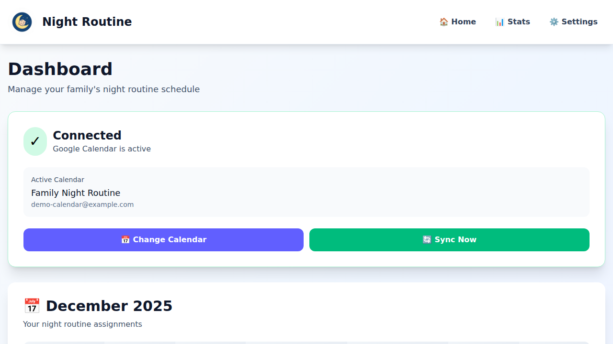
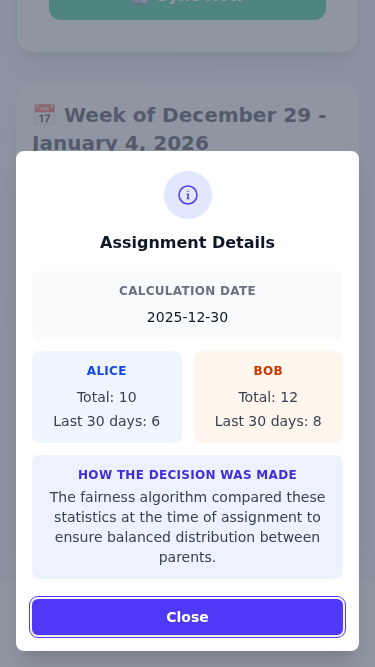

<div align="center">
  
  <h1>Night Routine Scheduler</h1>
</div>

A Go application that manages night routine scheduling between two parents, with Google Calendar integration for automated event creation and optional babysitter assignment support.

## Why?

Managing night routine duties between parents can be challenging. This application automates the scheduling process with a sophisticated fairness algorithm that considers multiple factors:

- **Fair distribution** - Balances total assignments and recent patterns
- **Availability awareness** - Respects each parent's unavailable days
- **Transparency** - Every assignment includes a clear decision reason
- **Flexibility** - Supports manual overrides when life happens
- **Babysitter support** - Assign specific dates to named babysitters, tracked separately from parent fairness
- **Google Calendar integration** - Seamlessly syncs with your existing calendar workflow

The application ensures both parents share night routine duties fairly while maintaining flexibility for real-world scheduling needs.

## Key Features

### Configuration Management

- **Web-Based Settings UI** - Intuitive interface for managing all runtime configuration
  - Configure parent names that appear in calendar events
  - Set availability constraints for each parent
  - Adjust schedule frequency and planning horizon
  - Changes take effect immediately without application restart

- **Database-Backed Configuration** - Settings stored in SQLite database
  - Persistent across application restarts
  - Atomic transactions ensure consistency
  - Database constraints validate data integrity
  - Automatic backup and migration support

- **Automatic Sync** - Settings changes trigger immediate calendar synchronization
  - Schedule recalculates based on new constraints
  - Calendar events updated automatically
  - Fairness algorithm adjusts to new availability patterns

- **Smart Initialization** - First-run setup made easy
  - Initial configuration from TOML file seeds database
  - Automatic migration from file-based to database configuration
  - Seamless upgrade path preserves existing settings

### Scheduling Intelligence

- **Fair Distribution** - Sophisticated algorithm balances assignments between parents
- **Availability Awareness** - Respects each parent's unavailable days
- **Transparency** - Every assignment includes a clear decision reason with detailed fairness calculations
- **Assignment Details** - Click any assignment to view the fairness algorithm calculations that determined the assignment
- **Flexibility** - Supports manual overrides when life happens
- **Babysitter Assignments** - Assign named babysitters to specific dates, excluded from parent fairness calculations
- **Google Calendar Integration** - Seamlessly syncs with your existing calendar workflow

## Screenshots

### Calendar Dashboard

The home page displays a monthly calendar grid with all night routine assignments. Each cell shows the assigned caregiver, the decision reason, and uses color coding for quick identification:

- **Blue** — Parent A assignments
- **Amber** — Parent B assignments
- **Gray** — Babysitter assignments
- **Lock icon** — Manually overridden (locked) assignments


_Calendar dashboard with equal-width columns and uniform row heights. Decision reasons (Total Count, Alternating, Double Consecutive Swap, etc.) wrap naturally within cells. The "Sync Now" button triggers schedule regeneration — the home page is read-only by default._

### Assignment Details Feature

Click on any assignment in the calendar to view detailed information about how the fairness algorithm made its decision:


_Desktop view: Click any assignment to see the calculation date and both parents' statistics (total assignments and last 30 days count) at the time the assignment was made._


_Mobile view: The assignment details modal is fully responsive and provides the same transparency on mobile devices._

The assignment details modal shows:

- **Calculation Date** - When the fairness algorithm evaluated this assignment
- **Parent Statistics** - Total assignments and last 30-day counts for both parents at decision time
- **Decision Explanation** - How the algorithm used these statistics to ensure balanced distribution

This feature provides complete transparency into the scheduling logic, helping families understand and trust the automated assignment process.

## Quick Start with Docker

Pre-built multi-architecture Docker images (supporting both amd64 and arm64) are available in the GitHub Container Registry:

```bash
# Pull the latest release
docker pull ghcr.io/belphemur/night-routine:latest

# Run the container
docker run \
  -e NR_OAUTH__CLIENT_ID=your-client-id \
  -e NR_OAUTH__CLIENT_SECRET=your-client-secret \

  -e CONFIG_FILE=/app/config/routine.toml \
  -v /path/to/config:/app/config \
  -v /path/to/data:/app/data \
  -p 8080:8080 \
  ghcr.io/belphemur/night-routine:latest
```

For easier setup with Docker Compose, see the [installation documentation](https://belphemur.github.io/night-routine/installation/docker-compose/).

_Note: These images are signed using Sigstore Cosign and include SBOM attestations for enhanced security._

## Documentation

For comprehensive documentation including configuration, features, and development guides, visit the [**Night Routine Scheduler Documentation**](https://belphemur.github.io/night-routine/).

**Quick Links:**

- [Features Overview](https://belphemur.github.io/night-routine/features/)
- [Installation Guide](https://belphemur.github.io/night-routine/installation/docker/)
- [Configuration](https://belphemur.github.io/night-routine/configuration/toml/)
- [First-Time Setup](https://belphemur.github.io/night-routine/user-guide/setup/)
- [Architecture & Design](https://belphemur.github.io/night-routine/architecture/overview/)

## License

This project is open source and available under the [AGPLv3 License](LICENSE).
