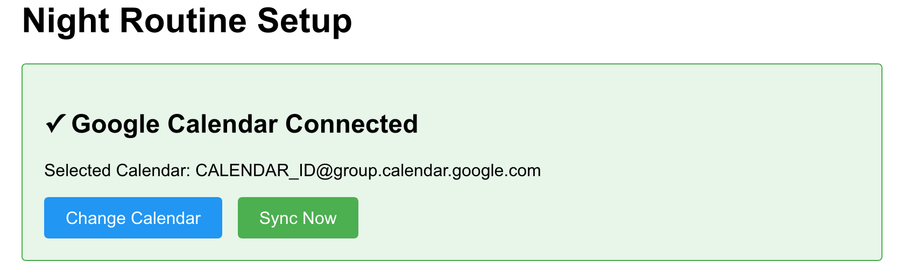

# Night Routine Scheduler

A Go application that manages night routine scheduling between two parents, with Google Calendar integration for automated event creation.

## Screenshots

### Setup Screen

_Initial setup screen where you connect to Google Calendar. Shows authentication status and provides quick access to calendar selection, manual sync, and statistics._

### Calendar Selection

_Select which Google Calendar to use for night routine events. Choose from your available calendars._

### Assignment Calendar View
The home page includes a visual monthly calendar showing:
- Color-coded assignments for each parent (blue for Parent A, orange for Parent B)
- Assignment decision reasons (hover on desktop, tap to toggle on mobile)
- Today's date highlighted in yellow
- Previous/next month padding days in gray

### Statistics Page
View monthly assignment counts for each parent over the last 12 months in an easy-to-read table format.

## Quick Start with Docker

Pre-built multi-architecture Docker images (supporting both amd64 and arm64) are available in the GitHub Container Registry:

```bash
# Pull the latest release
docker pull ghcr.io/belphemur/night-routine:latest

# Run the container
docker run \
  -e GOOGLE_OAUTH_CLIENT_ID=your-client-id \
  -e GOOGLE_OAUTH_CLIENT_SECRET=your-client-secret \
  -e PORT=8080 \
  -e CONFIG_FILE=/app/config/routine.toml \
  -v /path/to/config:/app/config \
  -v /path/to/data:/app/data \
  -p 8080:8080 \
  ghcr.io/belphemur/night-routine:latest
```

_Note: These images are signed using Sigstore Cosign and include SBOM attestations for enhanced security._

Available tags:

- `latest`: Most recent release
- `vX.Y.Z` (e.g., `v1.0.0`): Specific versions

## Quick Start with Docker Compose

For easier self-hosting, you can use the provided `docker-compose.yml` file:

```bash
# Downlaod file
https://github.com/Belphemur/night-routine/blob/main/docker-compose.yml

# Create the config directory
mkdir -p config
cp configs/routine.toml config/

# Edit the configuration file
nano config/routine.toml

# Edit docker-compose.yml to set your environment variables
nano docker-compose.yml

# Start the service
docker-compose up -d
```

This will create the necessary directories for configuration and data persistence, and start the application in the background.

## Features

### Core Scheduling
- **Advanced fairness algorithm** with multiple decision criteria:
  - Total assignment count balancing
  - Recent assignment count consideration
  - Consecutive assignment limits
  - Alternating pattern maintenance
  - Parent availability constraints
  - Decision reason tracking for transparency
- **Flexible scheduling** with configurable update frequencies (daily/weekly/monthly)
- **Look-ahead scheduling** for configurable number of days
- **Manual sync on startup** (configurable, enabled by default)

### Google Calendar Integration
- **OAuth2 authentication** with secure token management
- **Automatic event creation** with parent assignments
- **Event descriptions** include assignment decision reasons
- **Webhook support** for real-time calendar change notifications
- **Manual override support** via calendar event title editing (configurable threshold)
- **Automatic notification channel management** with expiration handling
- **No reminders** on created events to avoid notification fatigue

### Web Interface
- **Home page** with:
  - Authentication status display
  - Visual monthly assignment calendar
  - Quick access to sync and statistics
  - Color-coded assignments by parent
  - Assignment decision reasons (hover on desktop, always visible on mobile)
- **Calendar selection page** for choosing which Google Calendar to use
- **Statistics page** showing monthly assignment counts for the last 12 months
- **Manual sync button** for on-demand schedule updates
- **Responsive design** optimized for both desktop and mobile

### Data Management
- **SQLite database** for persistent storage:
  - Assignment history and fairness tracking
  - OAuth2 tokens with automatic refresh
  - Selected Google Calendar configuration
  - Notification channel management
- **Configurable parent availability** (days of week)
- **Assignment decision tracking** with reasons:
  - Unavailability
  - Total Count
  - Recent Count
  - Consecutive Limit
  - Alternating
  - Manual Override

### Operations & Deployment
- **Structured logging** using [zerolog](https://github.com/rs/zerolog):
  - Configurable log levels (trace, debug, info, warn, error, fatal, panic)
  - Pretty console output for development
  - JSON output for production
- **Docker containerization** with pre-built images
- **Multi-architecture support** (amd64, arm64)
- **Signed images** with Sigstore Cosign
- **SBOM attestations** for security
- **WAL mode SQLite** for better concurrency
- **Graceful shutdown** handling

## First-Time Setup

1. **Start the application** using Docker or by running the binary directly
2. **Visit the web interface** at the URL specified in your config's `app_url` (default: `http://localhost:8080`)
3. **Connect to Google Calendar**:
   - Click "Connect Google Calendar" button on the home page
   - Complete the OAuth flow by logging into your Google account
   - Grant the requested calendar permissions
4. **Select a calendar**:
   - After authentication, you'll be redirected to the calendar selection page
   - Choose which Google Calendar to use for night routine events
   - The application will automatically set up webhook notifications for real-time updates
5. **Review the schedule**:
   - Return to the home page to see your assignment calendar
   - View the visual monthly calendar with color-coded assignments
   - Hover over (or tap on mobile) assignments to see decision reasons
6. **Explore additional features**:
   - Click "Sync Now" to manually trigger a schedule update
   - Visit the "View Statistics" page to see historical assignment data
   - Manually override assignments by editing event titles in Google Calendar (within the configured threshold)

**Note**: Authentication tokens and calendar selection are stored in the SQLite database and persist between restarts. You only need to authenticate once unless you revoke access or delete the database file.

## Configuration

### Google Calendar Setup

1. Go to the [Google Cloud Console](https://console.cloud.google.com/)
2. Create a new project or select an existing one
3. Enable the Google Calendar API
4. Create OAuth 2.0 credentials
5. Note your Client ID and Client Secret
6. Set up environment variables with the credentials

### Environment Variables

Set up the following environment variables for Google OAuth2:

```bash
# Required environment variables
GOOGLE_OAUTH_CLIENT_ID=your-client-id          # OAuth2 credentials from Google Cloud Console
GOOGLE_OAUTH_CLIENT_SECRET=your-client-secret  # OAuth2 credentials from Google Cloud Console
CONFIG_FILE=configs/routine.toml               # Path to TOML configuration file

# Optional environment variables
PORT=8080                                      # Override port from TOML configuration
ENV=development                                # Set to "production" for JSON logging, otherwise pretty console logging
```

**Important Notes:**
- Application URLs (for OAuth callback and webhooks) are configured in the TOML file under the `[app]` section
- The OAuth2 callback URL is automatically constructed as `<app_url>/oauth/callback`
- When setting up OAuth2 in Google Cloud Console, use `http://localhost:8080/oauth/callback` for local development
- For production, ensure your `app_url` matches your actual domain/IP and add it to Google Cloud Console authorized redirect URIs

### Application Configuration

Create a `configs/routine.toml` file:

```toml
[app]
port = 8080                              # Port to listen on (can be overridden by PORT env var)
app_url = "http://localhost:8080"        # Internal application URL for OAuth and general routes
public_url = "http://localhost:8080"     # Public URL for webhooks and external integrations

[parents]
parent_a = "Parent1"                     # First parent name
parent_b = "Parent2"                     # Second parent name

[availability]
parent_a_unavailable = ["Wednesday"]     # Days when parent A can't do the routine
parent_b_unavailable = ["Monday"]        # Days when parent B can't do the routine

[schedule]
update_frequency = "weekly"              # How often to update the calendar
look_ahead_days = 30                     # How many days to schedule in advance
past_event_threshold_days = 5            # How many days in the past to accept event changes (default: 5)

[service]
state_file = "data/state.db"            # SQLite database file for state tracking
log_level = "info"                      # Logging level (trace, debug, info, warn, error, fatal, panic)
# manual_sync_on_startup = true         # Optional: Perform sync on startup (defaults to true). Set to false to disable.
```

Note: In production environments:

- Set `app_url` to your internal/private application URL for OAuth callbacks and general routes
- Set `public_url` to your publicly accessible URL for webhooks from external services

## Web Interface

The application provides a clean, responsive web interface accessible at your configured `app_url`:

### Home Page (`/`)
- **Authentication Status**: Shows whether you're connected to Google Calendar
- **Visual Assignment Calendar**: 
  - Monthly view with color-coded parent assignments
  - Blue background for Parent A assignments
  - Orange background for Parent B assignments
  - Yellow highlight for today's date
  - Gray background for padding days (previous/next month)
  - Assignment decision reasons (hover tooltip on desktop, tap to show on mobile)
- **Quick Actions**:
  - "Connect Google Calendar" (if not authenticated)
  - "Change Calendar" (switch to a different calendar)
  - "Sync Now" (manually trigger schedule update)
  - "View Statistics" (see historical data)

### Calendar Selection Page (`/calendars`)
- Lists all available Google Calendars from your account
- Select which calendar to use for night routine events
- Automatically sets up webhook notifications after selection

### Statistics Page (`/statistics`)
- Table showing assignment counts per parent per month
- Displays data for the last 12 months
- Helps verify fair distribution over time
- Shows only months with actual assignments

### API Endpoints
- `/auth` - Initiates Google OAuth2 flow
- `/oauth/callback` - OAuth2 callback handler
- `/sync` - Manual schedule synchronization
- `/api/webhook/calendar` - Google Calendar webhook receiver (for real-time updates)

## Logging

The application uses [zerolog](https://github.com/rs/zerolog) for structured logging.

- By default (or when `ENV=development`), logs are output to the console in a human-readable format.
- When `ENV=production`, logs are output as JSON to stdout.
- The log level can be configured using the `log_level` setting in `configs/routine.toml`.

## Assignment Decision Logic

The application uses a sophisticated fairness algorithm to assign night routines between parents. Each assignment includes a decision reason that explains why a particular parent was chosen:

### Decision Reasons

1. **Unavailability**: One parent is unavailable on that day (configured in `parent_a_unavailable` or `parent_b_unavailable`)
2. **Total Count**: Parent assigned because they have fewer total assignments overall
3. **Recent Count**: Parent assigned because they have fewer assignments in the recent period
4. **Consecutive Limit**: Parent assigned to avoid giving the other parent too many consecutive assignments
5. **Alternating**: Parent assigned to maintain a fair alternating pattern
6. **Override**: Assignment was manually changed via Google Calendar event editing

These decision reasons are:
- Displayed in the calendar event description in Google Calendar
- Shown as tooltips on the web interface calendar (hover on desktop)
- Visible inline on mobile devices (tap calendar to toggle)
- Tracked in the database for statistics and fairness calculations

## Override Night Routine (via Google Calendar Event Title)

You can manually override a scheduled night routine assignment directly in Google Calendar **for events within a configurable time window**. By default, the application accepts changes for events up to 5 days in the past (configurable via `past_event_threshold_days`). Overrides for events beyond this threshold will be ignored.

**How it works:**

1.  Find the specific night routine event in your Google Calendar (e.g., `"[ParentA] 🌃👶Routine"`).
2.  Edit the event title and change the parent's name within the square brackets (e.g., change it to `"[ParentB] 🌃👶Routine"`).
3.  Save the event change in Google Calendar.

Google Calendar will send a notification to the application's webhook endpoint (`/api/webhook/calendar`). The application will then:

- Verify the notification.
- Detect the parent name change in the event title.
- Check if the event date is within the configured threshold (default: 5 days in the past).
- Update its internal database record for that specific date to reflect the override (only if within the threshold).
- Recalculate subsequent future assignments if needed to maintain fairness based on this manual change.
- Sync any recalculated assignments back to Google Calendar.

**Configuration:**

You can adjust the time window for accepting past event changes by setting `past_event_threshold_days` in your `routine.toml`:

```toml
[schedule]
past_event_threshold_days = 5  # Accept changes up to 5 days in the past (default)
```

This keeps the application's schedule and fairness tracking accurate even with manual adjustments. For a detailed technical explanation, see the Webhook Handler section in `docs/architecture.md`.

## Development

### Prerequisites

- Go 1.25 or later
- Google Calendar API credentials (Client ID and Secret)
- Docker (optional, for containerized deployment)

### Running Locally

1. Clone the repository:
```bash
git clone https://github.com/Belphemur/night-routine.git
cd night-routine
```

2. Create and configure your environment:
```bash
# Copy the example configuration
cp configs/routine.toml configs/my-routine.toml

# Edit the configuration
nano configs/my-routine.toml

# Set environment variables
export GOOGLE_OAUTH_CLIENT_ID=your-client-id
export GOOGLE_OAUTH_CLIENT_SECRET=your-client-secret
export CONFIG_FILE=configs/my-routine.toml
export ENV=development
```

3. Build and run:
```bash
# Build the application
go build -o night-routine ./cmd/night-routine/

# Run the application
./night-routine
```

4. Open your browser to `http://localhost:8080` (or your configured port)

### Storage

The application uses SQLite for persistent storage:

```
data/
└── state.db  # SQLite database containing:
    ├── assignments           # Night routine assignments with decision reasons
    ├── oauth_tokens          # Google OAuth2 tokens (encrypted)
    ├── calendar_settings     # Selected calendar configuration
    └── notification_channels # Google Calendar webhook channels
```

**Database Features:**
- WAL (Write-Ahead Logging) mode for better concurrency
- Automatic migrations on startup
- Foreign key constraints enabled
- Incremental auto-vacuum

### Running Tests

```bash
# Run all tests
go test -v ./...

# Run tests with coverage
go test -v -cover ./...

# Run specific package tests
go test -v ./internal/fairness/...
```

### Making a Release

1. Tag your commit:

```bash
git tag -a v1.0.0 -m "Release v1.0.0"
```

2. Push the tag:

```bash
git push origin v1.0.0
```

This will trigger the GitHub Actions release workflow, which will:

- Run tests
- Build binaries for multiple platforms
- Create a Docker image
- Create a GitHub release

## Security Notes

- OAuth2 credentials are handled via environment variables for security
- Tokens are securely stored in the SQLite database
- Use HTTPS in production environments (e.g., via a reverse proxy)
- Keep your environment variables secure
- Regularly update dependencies

## License

This project is open source and available under the [AGPLv3 License](LICENSE).
