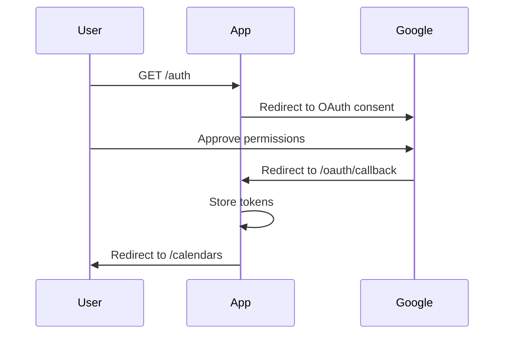

# API Reference

Night Routine Scheduler provides a RESTful API for managing night routine assignments and Google Calendar integration.

## Base URL

```
http://localhost:8080
```

Replace with your configured `app_url`.

## Authentication

Most endpoints require an authenticated Google OAuth session. Authentication is managed through cookies after the OAuth flow completes.

### OAuth Flow



## Endpoints

### Authentication

#### `GET /auth`

Initiates the Google OAuth2 authentication flow.

**Request:**
```http
GET /auth HTTP/1.1
Host: localhost:8080
```

**Response:**
```http
HTTP/1.1 302 Found
Location: https://accounts.google.com/o/oauth2/v2/auth?...
```

**Redirects to:** Google OAuth consent screen

**After authorization:** Redirects to `/oauth/callback`

---

#### `GET /oauth/callback`

OAuth2 callback endpoint. Handles the response from Google after user authorization.

**Request:**
```http
GET /oauth/callback?code=AUTH_CODE&state=STATE HTTP/1.1
Host: localhost:8080
```

**Query Parameters:**

| Parameter | Type | Description |
|-----------|------|-------------|
| `code` | string | Authorization code from Google |
| `state` | string | State parameter for CSRF protection |

**Response:**
```http
HTTP/1.1 302 Found
Location: /calendars
Set-Cookie: session=...; Path=/; HttpOnly
```

**Redirects to:** `/calendars` (calendar selection page)

---

### Calendar Management

#### `GET /calendars`

Lists all available Google Calendars and allows selection.

**Request:**
```http
GET /calendars HTTP/1.1
Host: localhost:8080
Cookie: session=...
```

**Response:**
```http
HTTP/1.1 200 OK
Content-Type: text/html

<html>
  <!-- Calendar selection page -->
</html>
```

**Authentication:** Required

**Response:** HTML page with calendar list

---

#### `POST /calendars/select`

Selects a Google Calendar for night routine events.

**Request:**
```http
POST /calendars/select HTTP/1.1
Host: localhost:8080
Cookie: session=...
Content-Type: application/x-www-form-urlencoded

calendar_id=primary
```

**Form Parameters:**

| Parameter | Type | Required | Description |
|-----------|------|----------|-------------|
| `calendar_id` | string | Yes | Google Calendar ID to use |

**Response:**
```http
HTTP/1.1 302 Found
Location: /
```

**Authentication:** Required

**Actions:**
1. Saves calendar selection to database
2. Sets up webhook notification channel
3. Creates initial night routine events
4. Redirects to home page

---

### Home Page

#### `GET /`

Displays the main dashboard with the visual assignment calendar.

**Request:**
```http
GET / HTTP/1.1
Host: localhost:8080
Cookie: session=...
```

**Response:**
```http
HTTP/1.1 200 OK
Content-Type: text/html

<html>
  <!-- Home page with calendar view -->
</html>
```

**Features:**
- Authentication status
- Visual monthly calendar
- Assignment details
- Quick action buttons

---

### Synchronization

#### `POST /sync`

Manually triggers a schedule synchronization.

**Request:**
```http
POST /sync HTTP/1.1
Host: localhost:8080
Cookie: session=...
```

**Response:**
```http
HTTP/1.1 302 Found
Location: /
```

**Authentication:** Required

**Actions:**
1. Calculates new assignments based on fairness algorithm
2. Creates/updates Google Calendar events
3. Stores assignments in database
4. Redirects to home page

**Use Cases:**
- After configuration changes
- To fill in new dates
- After manual event changes in Google Calendar

---

### Statistics

#### `GET /statistics`

Displays monthly assignment statistics for the last 12 months.

**Request:**
```http
GET /statistics HTTP/1.1
Host: localhost:8080
Cookie: session=...
```

**Response:**
```http
HTTP/1.1 200 OK
Content-Type: text/html

<html>
  <!-- Statistics page with monthly breakdown -->
</html>
```

**Authentication:** Required

**Data Shown:**
- Monthly assignment counts per parent
- Last 12 months
- Total assignments per month

---

### Webhooks

#### `POST /api/webhook/calendar`

Receives Google Calendar change notifications.

**Request:**
```http
POST /api/webhook/calendar HTTP/1.1
Host: your-public-url.com
X-Goog-Channel-ID: channel-id
X-Goog-Channel-Token: token
X-Goog-Resource-ID: resource-id
X-Goog-Resource-State: exists
X-Goog-Resource-URI: https://www.googleapis.com/calendar/v3/calendars/...
X-Goog-Message-Number: 1
```

**Headers:**

| Header | Description |
|--------|-------------|
| `X-Goog-Channel-ID` | Notification channel ID |
| `X-Goog-Channel-Token` | Verification token |
| `X-Goog-Resource-ID` | Google Calendar resource ID |
| `X-Goog-Resource-State` | Resource state (exists, not_exists, sync) |
| `X-Goog-Resource-URI` | Calendar API endpoint |
| `X-Goog-Message-Number` | Sequential message number |

**Response:**
```http
HTTP/1.1 200 OK
```

**Authentication:** Validated via channel token

**Actions:**
1. Validates webhook headers
2. Fetches updated calendar events
3. Detects manual overrides
4. Updates database
5. Recalculates future assignments if needed

**Triggered When:**
- Calendar events are created
- Events are modified
- Events are deleted

---

## Response Codes

| Code | Meaning | Description |
|------|---------|-------------|
| 200 | OK | Successful request |
| 302 | Found | Redirect (common for form submissions) |
| 400 | Bad Request | Invalid request parameters |
| 401 | Unauthorized | Not authenticated |
| 403 | Forbidden | Authenticated but not authorized |
| 404 | Not Found | Resource not found |
| 500 | Internal Server Error | Server error |

## Error Responses

### HTML Error Pages

For browser requests, errors return HTML pages:

```html
<html>
  <body>
    <h1>Error</h1>
    <p>Error message here</p>
  </body>
</html>
```

### Common Errors

#### Not Authenticated

**Response:**
```http
HTTP/1.1 302 Found
Location: /auth
```

**Solution:** Complete OAuth authentication

#### Invalid Calendar ID

**Response:**
```http
HTTP/1.1 400 Bad Request
Content-Type: text/html

<html>
  <body>
    <h1>Error</h1>
    <p>Invalid calendar ID</p>
  </body>
</html>
```

**Solution:** Select a valid calendar from the list

#### Webhook Validation Failed

**Response:**
```http
HTTP/1.1 403 Forbidden
```

**Solution:** Ensure webhook is properly configured with correct token

## Rate Limiting

The application does not implement rate limiting on its own endpoints. However, Google Calendar API has its own limits:

- **Queries per day:** 1,000,000
- **Queries per 100 seconds per user:** 10,000

The application is well within these limits for normal use.

## Webhook Setup

Google Calendar webhooks require configuration in the application:

### Configuration

```toml
[app]
public_url = "https://your-public-url.com"  # Must be publicly accessible
```

### Channel Lifecycle

1. **Creation:** Automatic when calendar is selected
2. **Expiration:** Typically 7-30 days
3. **Renewal:** Automatic before expiration
4. **Validation:** Via channel token in webhook headers

### Webhook Security

- **Channel Token:** Random UUID for validation
- **HTTPS:** Required for production
- **Header Validation:** All required headers must be present

## Examples

### Complete OAuth Flow

```bash
# 1. Start authentication
curl -L http://localhost:8080/auth

# User completes OAuth in browser

# 2. After callback, select calendar
curl -X POST http://localhost:8080/calendars/select \
  -b cookies.txt \
  -d "calendar_id=primary"

# 3. View home page
curl -b cookies.txt http://localhost:8080/
```

### Manual Sync

```bash
curl -X POST http://localhost:8080/sync \
  -b cookies.txt
```

### View Statistics

```bash
curl -b cookies.txt http://localhost:8080/statistics
```

## Data Models

### Assignment

Represents a night routine assignment.

```go
type Assignment struct {
    ID        int64     // Database ID
    Date      time.Time // Assignment date
    Parent    string    // Parent name (ParentA or ParentB)
    Reason    string    // Decision reason
    CreatedAt time.Time // Creation timestamp
    UpdatedAt time.Time // Last update timestamp
}
```

**Decision Reasons:**
- `Unavailability`
- `Total Count`
- `Recent Count`
- `Consecutive Limit`
- `Alternating`
- `Override`

### OAuth Token

Stores Google OAuth2 credentials.

```go
type OAuthToken struct {
    ID           int64     // Always 1 (single row)
    AccessToken  string    // OAuth2 access token
    RefreshToken string    // OAuth2 refresh token
    TokenType    string    // Token type (Bearer)
    Expiry       time.Time // Token expiration
    CreatedAt    time.Time // Creation timestamp
    UpdatedAt    time.Time // Last update timestamp
}
```

### Calendar Settings

Stores selected calendar information.

```go
type CalendarSettings struct {
    ID           int64     // Always 1 (single row)
    CalendarID   string    // Google Calendar ID
    CalendarName string    // Display name
    CreatedAt    time.Time // Creation timestamp
    UpdatedAt    time.Time // Last update timestamp
}
```

### Notification Channel

Manages webhook notification channels.

```go
type NotificationChannel struct {
    ID         int64     // Database ID
    ChannelID  string    // Google channel ID
    ResourceID string    // Google resource ID
    Expiration time.Time // Channel expiration
    CreatedAt  time.Time // Creation timestamp
    UpdatedAt  time.Time // Last update timestamp
}
```

## SDK / Client Libraries

The application is primarily accessed through the web interface. For programmatic access, standard HTTP clients can be used:

### cURL

```bash
# Authenticate (in browser)
# Then use cookies for subsequent requests

curl -b cookies.txt http://localhost:8080/sync -X POST
```

### Python

```python
import requests

session = requests.Session()

# After OAuth (manual browser step)
# Session cookies are automatically managed

response = session.post('http://localhost:8080/sync')
print(response.status_code)
```

### Go

```go
import (
    "net/http"
    "net/http/cookiejar"
)

jar, _ := cookiejar.New(nil)
client := &http.Client{
    Jar: jar,
}

// After OAuth (manual browser step)
resp, err := client.Post("http://localhost:8080/sync", "", nil)
```

## Changelog

API changes are documented in the project [CHANGELOG.md](https://github.com/Belphemur/night-routine/blob/main/CHANGELOG.md).

## Support

- **Issues:** [GitHub Issues](https://github.com/Belphemur/night-routine/issues)
- **Documentation:** [Full Documentation](https://belphemur.github.io/night-routine/)

## Next Steps

- [Understand the architecture](architecture/overview.md)
- [Learn about webhooks](user-guide/web-interface.md#webhooks)
- [Set up Google Calendar](configuration/google-calendar.md)
