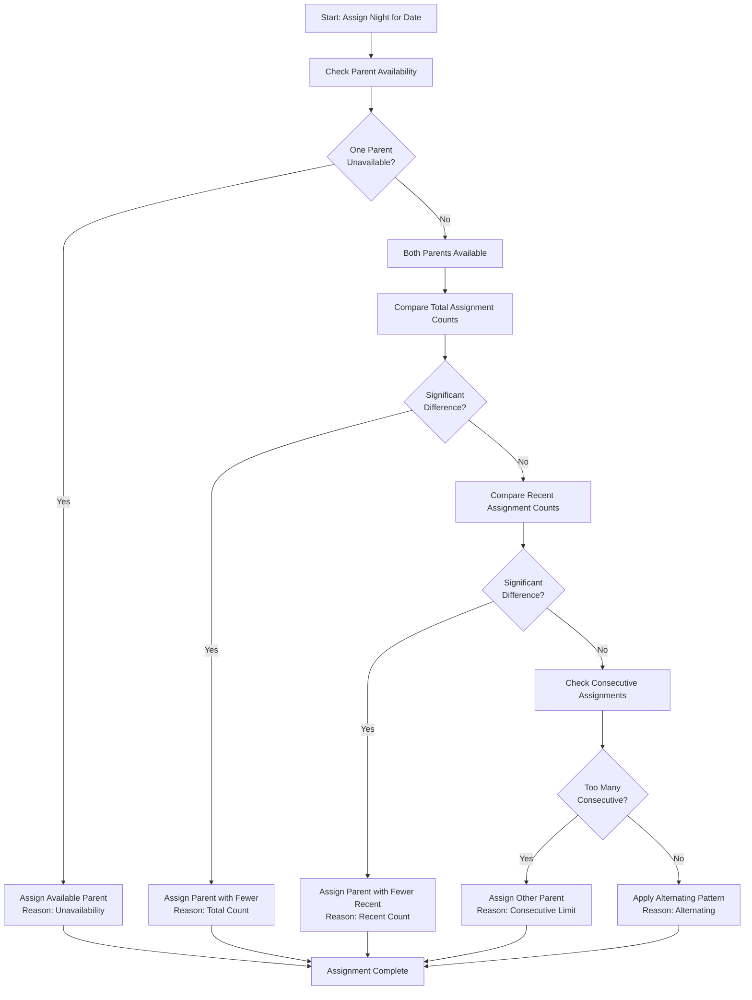

# Assignment Decision Logic

The Night Routine Scheduler uses a sophisticated fairness algorithm to determine which parent is assigned to each night's routine. This page explains how assignments are decided.

## Decision Flow



## Decision Criteria (Priority Order)

The algorithm evaluates criteria in this order:

### 1. Unavailability

**Highest Priority**

If one parent is unavailable on a given day (configured in `availability` section), the other parent is automatically assigned.

**Configuration:**
```toml
[availability]
parent_a_unavailable = ["Wednesday"]
parent_b_unavailable = ["Monday"]
```

**Example:**
- Monday: Parent A assigned (Parent B unavailable)
- Wednesday: Parent B assigned (Parent A unavailable)

**Decision Reason:** `Unavailability`

### 2. Total Count Balance

If both parents are available, compare their total lifetime assignment counts.

**Logic:**
- Count all assignments for each parent
- If one parent has significantly fewer assignments (typically 2+ fewer), assign that parent

**Example:**
- Parent A: 50 total assignments
- Parent B: 48 total assignments
- Difference is small (2), continue to next criterion

**Decision Reason:** `Total Count`

### 3. Recent Count Balance

Compare assignment counts from the recent period (last 30 days).

**Logic:**
- Count recent assignments (last 30 days) for each parent
- If one parent has fewer recent assignments, assign that parent

**Example:**
- Parent A: 3 assignments in last 30 days
- Parent B: 6 assignments in last 30 days
- Assign Parent A

**Decision Reason:** `Recent Count`

### 4. Consecutive Limit

Prevent one parent from having too many consecutive night assignments.

**Logic:**
- Check how many consecutive nights the current parent has been assigned
- If limit reached (2 consecutive nights), switch to the other parent

**Example:**
- Last 2 nights: Parent A, Parent A
- Tonight: Assign Parent B (consecutive limit reached)

**Decision Reason:** `Consecutive Limit`

### 5. Alternating Pattern

**Default Behavior**

When all other criteria are equal, maintain a simple alternating pattern.

**Logic:**
- Check who was assigned yesterday
- Assign the other parent

**Example:**
- Yesterday: Parent A
- Tonight: Parent B
- Tomorrow: Parent A

**Decision Reason:** `Alternating`

### 6. Manual Override

When you manually change an event title in Google Calendar, the system records this as an override.

**Detection:**
- Google Calendar sends webhook notification
- Application detects parent name change
- Internal database is updated
- Future assignments recalculated to maintain fairness

**Decision Reason:** `Override`

## Fairness Algorithm Details

### Balancing Total Counts

The algorithm tracks lifetime assignment counts:

```go
totalCountA := countAssignments(ParentA, allTime)
totalCountB := countAssignments(ParentB, allTime)

if totalCountA < totalCountB - threshold {
    assign(ParentA, "Total Count")
} else if totalCountB < totalCountA - threshold {
    assign(ParentB, "Total Count")
}
```

**Threshold:** Typically 1-2 assignments

### Recent Count Window

Recent counts use a sliding window of 30 days:

```go
recentCountA := countAssignments(ParentA, last30Days)
recentCountB := countAssignments(ParentB, last30Days)

if recentCountA < recentCountB {
    assign(ParentA, "Recent Count")
} else if recentCountB < recentCountA {
    assign(ParentB, "Recent Count")
}
```

### Consecutive Limit Logic

```go
consecutiveCount := 1
for i := 1; i < len(lastAssignments); i++ {
    if lastAssignments[i].parent == lastParent {
        consecutiveCount++
    } else {
        break
    }
}

if consecutiveCount >= 2 {
    assign(otherParent, "Consecutive Limit")
}
```

**Limit:** 2 consecutive assignments

## Example Scenarios

### Scenario 1: Basic Alternating

**Setup:**
- No unavailable days
- Equal total counts
- No recent imbalance

**Result:**
```
Mon: Parent A (Alternating)
Tue: Parent B (Alternating)
Wed: Parent A (Alternating)
Thu: Parent B (Alternating)
```

### Scenario 2: Unavailability

**Setup:**
```toml
parent_a_unavailable = ["Wednesday", "Friday"]
```

**Result:**
```
Mon: Parent A (Alternating)
Tue: Parent B (Alternating)
Wed: Parent B (Unavailability - A unavailable)
Thu: Parent A (Alternating)
Fri: Parent B (Unavailability - A unavailable)
Sat: Parent A (Alternating)
```

### Scenario 3: Imbalanced Counts

**Setup:**
- Parent A: 45 total assignments
- Parent B: 50 total assignments

**Result:**
```
Mon: Parent A (Total Count - fewer overall)
Tue: Parent A (Total Count - still fewer overall)
Wed: Parent A (Total Count - catching up)
Thu: Parent B (Now balanced)
Fri: Parent A (Alternating)
```

### Scenario 4: Consecutive Limit

**Setup:**
- Last 2 nights: Parent A
- Consecutive limit: 2

**Result:**
```
Thu: Parent B (Consecutive Limit - A had 2 in a row)
Fri: Parent A (Alternating)
Sat: Parent B (Alternating)
```

### Scenario 5: Manual Override

**Action:** Manually change Monday from Parent A to Parent B in Google Calendar

**Result:**
```
Mon: Parent B (Override - manually changed)
Tue: Parent A (Total Count - compensating for override)
Wed: Parent B (Alternating)
Thu: Parent A (Alternating)
```

## Configuration Impact

### Update Frequency

```toml
[schedule]
update_frequency = "weekly"  # How often to recalculate
```

- **daily** - Recalculates every day, most responsive
- **weekly** - Recalculates weekly, more stable
- **monthly** - Recalculates monthly, least frequent changes

### Look-Ahead Days

```toml
[schedule]
look_ahead_days = 30  # How far to schedule in advance
```

Determines how many days are scheduled at once. Longer periods provide more visibility but less flexibility for manual changes.

### Past Event Threshold

```toml
[schedule]
past_event_threshold_days = 5
```

Controls how far back manual overrides are accepted. Prevents old assignments from affecting current balance calculations.

## Monitoring Fairness

### Statistics Page

View the statistics page to verify fair distribution:

| Month | Parent A | Parent B | Total |
|-------|----------|----------|-------|
| Jan 2024 | 15 | 16 | 31 |
| Feb 2024 | 14 | 14 | 28 |

**Healthy Distribution:**
- Difference of 0-1 for months with even days
- Difference of 1 for months with odd days

### Decision Reason Tracking

Every assignment includes its decision reason, viewable in:

- Web interface (hover/tap on dates)
- Google Calendar event descriptions
- Database queries

This transparency helps you understand why each assignment was made.

## Edge Cases

### Both Parents Unavailable

**Scenario:** Both parents marked unavailable on the same day

**Behavior:** The algorithm will still assign someone (typically based on alternating pattern) but log a warning.

**Recommendation:** Avoid configuring overlapping unavailability.

### Starting from Scratch

**Scenario:** No historical assignments exist

**Behavior:**
- First assignment uses alternating pattern (starts with Parent A)
- Subsequent assignments build fairness tracking from there

### Long Gaps

**Scenario:** Application not used for months, then restarted

**Behavior:**
- Historical assignments remain in database
- New assignments calculated based on existing fairness state
- Old assignments beyond look-ahead window aren't deleted

## Advanced: Customizing the Algorithm

The fairness logic is in `internal/fairness/` and can be customized if needed:

**Key files:**
- `fairness.go` - Main decision logic
- `calculator.go` - Count calculations
- `types.go` - Decision reason types

**To customize:**
1. Modify the decision criteria in `fairness.go`
2. Adjust thresholds and weights
3. Rebuild the application
4. Test thoroughly with various scenarios

## Next Steps

- [Understand the database structure](database.md)
- [Learn about manual overrides](../user-guide/manual-overrides.md)
- [Explore the architecture](overview.md)
