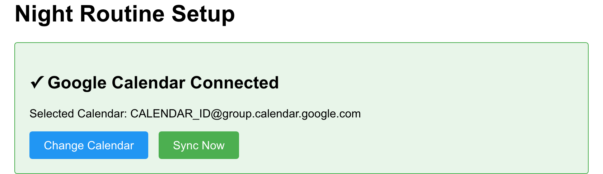
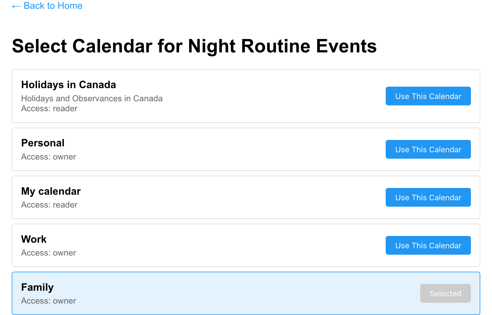

# Night Routine Scheduler

A Go application that manages night routine scheduling between two parents, with Google Calendar integration for automated event creation.

## Overview

Night Routine Scheduler is designed to help parents fairly distribute night routine duties. It features an advanced fairness algorithm, Google Calendar integration, and a responsive web interface for easy management.

## Quick Start

Get started quickly using our pre-built Docker images:

=== "Docker"

    ```bash
    # Pull the latest release
    docker pull ghcr.io/belphemur/night-routine:latest

    # Run the container
    docker run \
      -e GOOGLE_OAUTH_CLIENT_ID=your-client-id \
      -e GOOGLE_OAUTH_CLIENT_SECRET=your-client-secret \
      -e PORT=8080 \
      -e CONFIG_FILE=/app/config/routine.toml \
      -v /path/to/config:/app/config \
      -v /path/to/data:/app/data \
      -p 8080:8080 \
      ghcr.io/belphemur/night-routine:latest
    ```

=== "Docker Compose"

    ```bash
    # Download docker-compose.yml from the repository
    wget https://raw.githubusercontent.com/Belphemur/night-routine/main/docker-compose.yml

    # Create the config directory
    mkdir -p config
    cp configs/routine.toml config/

    # Edit the configuration file
    nano config/routine.toml

    # Edit docker-compose.yml to set your environment variables
    nano docker-compose.yml

    # Start the service
    docker-compose up -d
    ```

!!! info "Security Features"
    Docker images are signed using Sigstore Cosign and include SBOM attestations for enhanced security.

## Key Features

- **:material-scale-balance: Advanced Fairness Algorithm** - Multiple decision criteria ensure fair distribution
- **:material-google: Google Calendar Integration** - Automatic event creation with OAuth2 authentication
- **:material-monitor-dashboard: Responsive Web Interface** - Clean UI optimized for desktop and mobile
- **:material-database: SQLite Storage** - Persistent data with WAL mode for better concurrency
- **:material-docker: Docker Support** - Multi-architecture images (amd64, arm64)
- **:material-webhook: Real-time Webhooks** - Instant calendar change notifications

## Screenshots

### Setup Screen



_Initial setup screen where you connect to Google Calendar. Shows authentication status and provides quick access to calendar selection, manual sync, and statistics._

### Calendar Selection



_Select which Google Calendar to use for night routine events. Choose from your available calendars._

## Next Steps

- [Learn about all features](features.md)
- [Install with Docker](installation/docker.md)
- [Configure the application](configuration/toml.md)
- [Complete first-time setup](user-guide/setup.md)

## License

This project is open source and available under the [AGPLv3 License](https://github.com/Belphemur/night-routine/blob/main/LICENSE).
