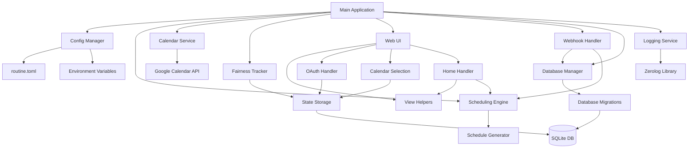
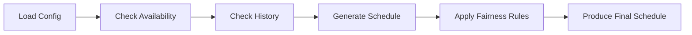
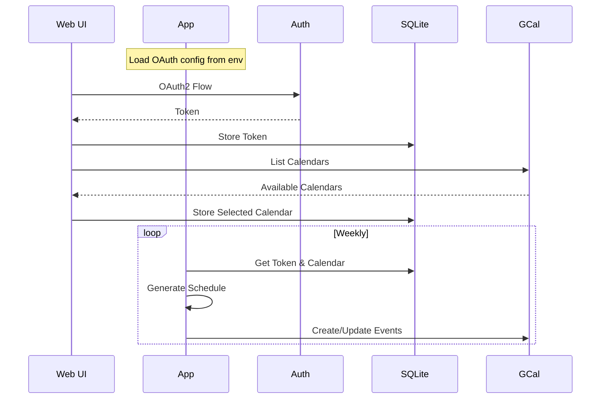

# Night Routine Scheduler Architecture

## 1. Project Structure



## 2. Components Breakdown

### 2.1 Configuration Manager

- Uses TOML format for application configuration
- Uses environment variables for sensitive data and environment settings (e.g., `ENV` for logging format)
- Configuration sources:

```toml
# routine.toml - Application configuration
[parents]
parent_a = "Parent1"
parent_b = "Parent2"

[availability]
parent_a_unavailable = ["Wednesday"]
parent_b_unavailable = ["Monday"]

[schedule]
update_frequency = "weekly"
look_ahead_days = 30

[service]
state_file = "data/state.db"
log_level = "info" # Logging level
```

### Environment Variables

```bash
# Environment Variables - Configuration
GOOGLE_OAUTH_CLIENT_ID=your-client-id       # OAuth2 Configuration
GOOGLE_OAUTH_CLIENT_SECRET=your-client-secret
PORT=8080                                   # Service Configuration
CONFIG_FILE=configs/routine.toml            # Path to TOML config file
APP_URL=http://localhost:8080               # (Optional) Override application URL
ENV=development                             # (Optional) "production" for JSON logs, otherwise pretty console logs
```

### 2.2 Scheduling Engine



### 2.3 Google Calendar Integration



### 2.4 Web Interface

- OAuth2 authentication flow using environment variables
- Calendar selection UI
- Components:
  - Home page with connection status and **assignment calendar view** (if authenticated).
  - OAuth callback handler
  - Calendar selection page
  - Success/error notifications
  - Uses `internal/viewhelpers` for calendar data structuring.
  - Home page fetches predicted schedule from `Scheduler`.

### 2.5 State Storage (SQLite)

- Database schema managed through migrations
- Migrations stored as embedded SQL files in the application
- Tables:

  ```sql
  -- Night routine assignments
  assignments (
    id INTEGER PRIMARY KEY AUTOINCREMENT,
    parent_name TEXT NOT NULL,
    assignment_date TEXT NOT NULL,
    override BOOLEAN DEFAULT FALSE,
    google_calendar_event_id TEXT,
    created_at DATETIME DEFAULT CURRENT_TIMESTAMP,
    updated_at DATETIME DEFAULT CURRENT_TIMESTAMP
  )

  -- OAuth tokens
  oauth_tokens (
    id INTEGER PRIMARY KEY, -- Should always be 1
    token_data JSONB NOT NULL,
    updated_at TIMESTAMP DEFAULT CURRENT_TIMESTAMP
  )

  -- Calendar settings
  calendar_settings (
    id INTEGER PRIMARY KEY, -- Should always be 1
    calendar_id TEXT NOT NULL,
    updated_at TIMESTAMP DEFAULT CURRENT_TIMESTAMP
  )

  -- Notification channels
  notification_channels (
      id TEXT PRIMARY KEY,
      resource_id TEXT NOT NULL,
      calendar_id TEXT NOT NULL,
      expiration DATETIME NOT NULL,
      created_at DATETIME DEFAULT CURRENT_TIMESTAMP,
      updated_at DATETIME DEFAULT CURRENT_TIMESTAMP
  )
  ```

### 2.6 Fairness Tracker

- Maintains state in SQLite to track:
  - Historical assignments
  - Consecutive assignments
  - Total count per parent
- Uses assignment data for scheduling decisions

### 2.7 Webhook Handler (Google Calendar Integration)

The application implements a webhook handler at `/api/webhook/calendar` specifically designed to process Google Calendar push notifications. This allows the system to react dynamically to manual changes made directly in the shared Google Calendar.

**Workflow:**

1.  **Notification Reception:** Google Calendar sends a push notification to the endpoint when a change occurs in the subscribed calendar.
2.  **Authentication & Validation:**
    - The handler verifies the `X-Goog-Channel-ID` and `X-Goog-Resource-ID` headers against the stored notification channel details (retrieved from the `notification_channels` table in SQLite). This ensures the notification is legitimate and originates from the expected Google Calendar subscription.
    - If the channel ID or resource ID doesn't match, the request is rejected (HTTP 400).
    - It checks the `X-Goog-Resource-State` header. If it's `sync`, it's an initial synchronization message, and the handler simply acknowledges it (HTTP 200) without further processing.
3.  **Channel Renewal Check:** The handler checks the expiration time of the notification channel. If it's nearing expiration (e.g., within 7 days), it proactively attempts to renew the subscription with Google Calendar using the stored refresh token and calendar ID.
4.  **Fetch Updated Events:** For actual change notifications (`X-Goog-Resource-State` is not `sync`), the handler uses the Google Calendar API to fetch events that have been updated recently (e.g., within the last 2 minutes). It uses the `updatedMin` parameter for efficiency.
5.  **Event Processing Loop:**
    - For each updated event retrieved:
      - **Ownership Check:** It verifies the event belongs to this application by checking for a specific private extended property (e.g., `private["app"] == "night-routine"`). Events without this property are ignored.
      - **Extract Parent:** It parses the event summary (expected format: `"[ParentName] 🌃👶Routine"`) to extract the assigned parent's name.
      - **Find Local Assignment:** It queries the `assignments` table using the `google_calendar_event_id` to find the corresponding local record.
      - **Change Detection:** It compares the extracted parent name with the parent name stored in the local assignment record.
      - **Date Check:** It ensures the assignment date is not in the past. Overrides for past dates are rejected.
      - **Update Local Assignment:** If the parent name has changed and the assignment is for today or the future, it updates the `parent_name` and sets the `override` flag to `true` in the `assignments` table for that record.
6.  **Trigger Schedule Recalculation:** If any local assignment was updated due to an override, the handler triggers the `Scheduler` component.
    - The scheduler regenerates the schedule starting from the date of the earliest overridden assignment up to the previously calculated end date.
    - This recalculation respects the new override(s) and applies fairness rules to the subsequent, non-overridden days.
7.  **Sync Recalculated Schedule:** The newly generated portion of the schedule is synced back to Google Calendar by the `CalendarService`, updating or creating events as necessary.
8.  **Acknowledge Notification:** Finally, the handler responds to the original Google Calendar push notification with an HTTP 200 OK status.

**Key Interactions:**

- **Database Manager:** Reads notification channel details, reads/writes assignment records.
- **Token Manager:** Obtains a valid OAuth2 token to interact with the Google Calendar API.
- **Calendar Service:** Renews notification channels, fetches updated events, syncs recalculated schedule.
- **Scheduler:** Retrieves assignments by event ID, updates assignments, triggers schedule regeneration.
- **Config Manager:** Provides Google API credentials.

### 2.8 Logging Service

- Centralized logging configuration in `internal/logging`.
- Uses [zerolog](https://github.com/rs/zerolog) for structured, leveled logging.
- Log level configured via `log_level` in `routine.toml`.
- Log format determined by `ENV` environment variable:
  - `development` (default): Human-readable console output.
  - `production`: JSON output to stdout.
- Provides helper functions (`GetLogger`) to create component-specific loggers with context.

## 3. Implementation Plan

1. **Phase 1: Core Structure**

   - Project initialization with Go 1.24
   - Environment variables configuration
   - Basic TOML configuration setup
   - Command-line interface
   - Docker configuration
   - SQLite schema setup

2. **Phase 2: Web Interface**

   - OAuth2 flow with environment variables
   - Calendar selection UI
   - Token storage in SQLite
   - Basic web server setup

3. **Phase 3: Scheduling Logic**

   - Schedule generation algorithm
   - Fairness rules implementation
   - State management
   - Database interactions

4. **Phase 4: Google Calendar Integration**

   - OAuth2 token management
   - Calendar API integration
   - Event management
   - Error handling

5. **Phase 5: Service Mode & Logging**

   - Background service implementation
   - Scheduling loop
   - Structured logging implementation (zerolog)
   - Health checks

## 4. Technical Specifications

### Technology Stack:

- Go 1.24
- Libraries:
  - `github.com/BurntSushi/toml` for TOML parsing
  - `google.golang.org/api/calendar/v3` for Google Calendar
  - `golang.org/x/oauth2` for OAuth2 handling
  - Built-in `database/sql` with `github.com/mattn/go-sqlite3` for state management
  - `github.com/golang-migrate/migrate/v4` for database migrations
  - `html/template` for web UI
  - `github.com/rs/zerolog` for logging

### Security Considerations:

- OAuth2 credentials stored in environment variables
- Tokens stored securely in SQLite database
- HTTPS recommended for production deployments
- Proper error handling for credential issues

### Database Management:

- Database schema versioned and managed through migrations
- Migrations embedded in the application binary using Go 1.16+ embed package
- Migration files organized in numbered pairs (up/down) for versioning
- Automatic migration at application startup
- Support for both schema creation and updates
