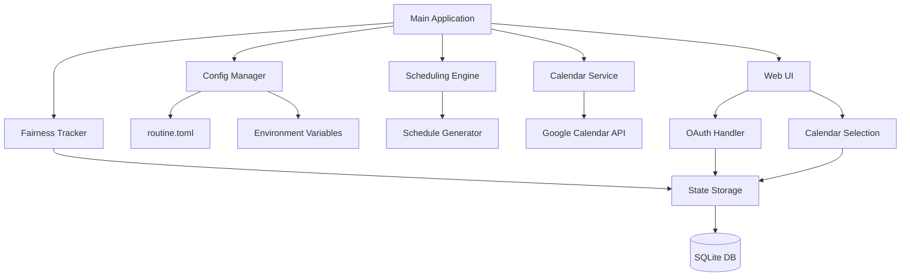
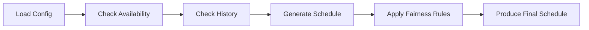
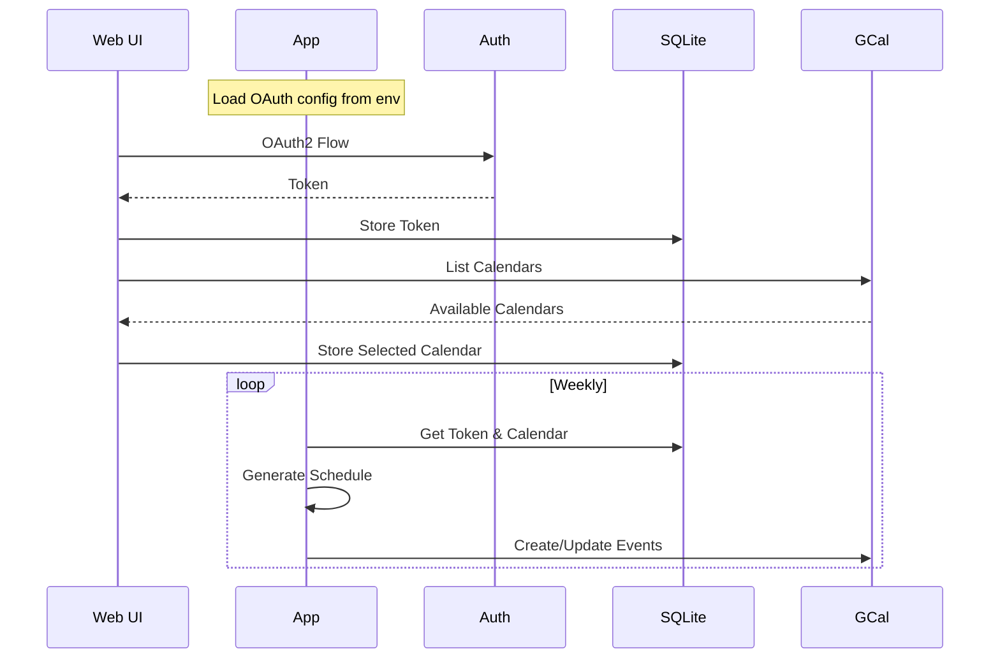

# Night Routine Scheduler Architecture

## 1. Project Structure



## 2. Components Breakdown

### 2.1 Configuration Manager

- Uses TOML format for application configuration
- Uses environment variables for sensitive data
- Configuration sources:

```toml
# routine.toml - Application configuration
[parents]
parent_a = "Parent1"
parent_b = "Parent2"

[availability]
parent_a_unavailable = ["Wednesday"]
parent_b_unavailable = ["Monday"]

[schedule]
update_frequency = "weekly"
look_ahead_days = 30

[service]
state_file = "data/state.db"
```

### Environment Variables

```bash
# Environment Variables - Configuration
GOOGLE_OAUTH_CLIENT_ID=your-client-id       # OAuth2 Configuration
GOOGLE_OAUTH_CLIENT_SECRET=your-client-secret
GOOGLE_OAUTH_REDIRECT_URL=http://localhost:8080/oauth/callback
PORT=8080                                   # Service Configuration
CONFIG_FILE=configs/routine.toml            # Path to TOML config file
APP_URL=http://localhost:8080               # (Optional) Override application URL
```

### 2.2 Scheduling Engine



### 2.3 Google Calendar Integration



### 2.4 Web Interface

- OAuth2 authentication flow using environment variables
- Calendar selection UI
- Components:
  - Home page with connection status
  - OAuth callback handler
  - Calendar selection page
  - Success/error notifications

### 2.5 State Storage (SQLite)

- Tables:

  ```sql
  -- Night routine assignments
  assignments (
    id INTEGER PRIMARY KEY,
    parent_name TEXT,
    assignment_date TEXT,
    created_at DATETIME
  )

  -- OAuth tokens
  oauth_tokens (
    id INTEGER PRIMARY KEY,
    token_data BLOB,
    updated_at DATETIME
  )

  -- Calendar settings
  calendar_settings (
    id INTEGER PRIMARY KEY,
    calendar_id TEXT,
    updated_at DATETIME
  )
  ```

### 2.6 Fairness Tracker

- Maintains state in SQLite to track:
  - Historical assignments
  - Consecutive assignments
  - Total count per parent
- Uses assignment data for scheduling decisions

## 3. Implementation Plan

1. **Phase 1: Core Structure**

   - Project initialization with Go 1.24
   - Environment variables configuration
   - Basic TOML configuration setup
   - Command-line interface
   - Docker configuration
   - SQLite schema setup

2. **Phase 2: Web Interface**

   - OAuth2 flow with environment variables
   - Calendar selection UI
   - Token storage in SQLite
   - Basic web server setup

3. **Phase 3: Scheduling Logic**

   - Schedule generation algorithm
   - Fairness rules implementation
   - State management
   - Database interactions

4. **Phase 4: Google Calendar Integration**

   - OAuth2 token management
   - Calendar API integration
   - Event management
   - Error handling

5. **Phase 5: Service Mode**
   - Background service implementation
   - Scheduling loop
   - Error handling and logging
   - Health checks

## 4. Technical Specifications

### Technology Stack:

- Go 1.24
- Libraries:
  - `github.com/BurntSushi/toml` for TOML parsing
  - `google.golang.org/api/calendar/v3` for Google Calendar
  - `github.com/robfig/cron` for scheduling
  - Built-in `database/sql` with SQLite for state management
  - `html/template` for web UI
  - `github.com/kelseyhightower/envconfig` for environment variables

### Security Considerations:

- OAuth2 credentials stored in environment variables
- Tokens stored securely in SQLite database
- HTTPS recommended for production deployments
- Proper error handling for credential issues

[Rest of the document remains unchanged...]
