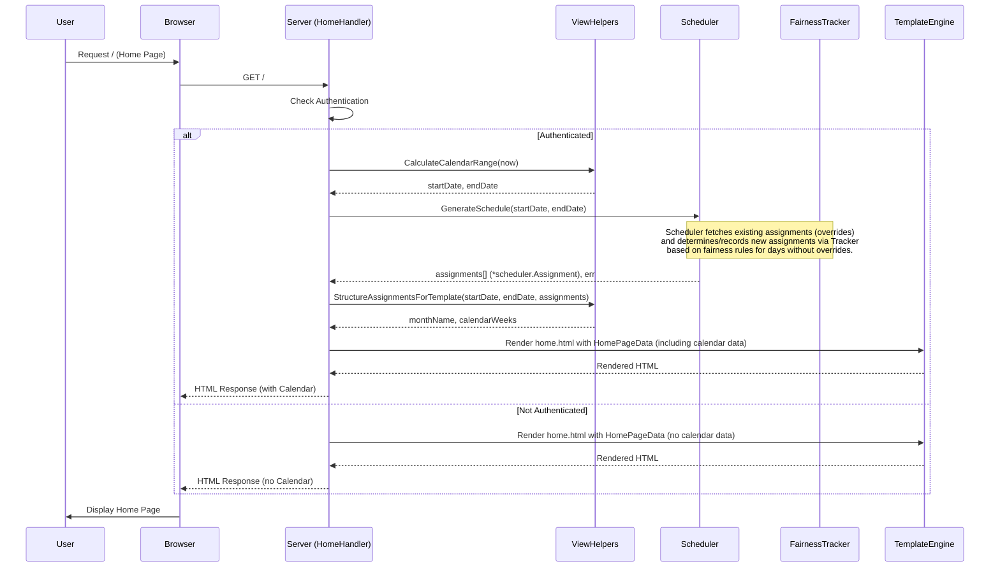

# Plan: Add Assignment Calendar View (using Scheduler) to Home Page

**Goal:** Integrate a calendar view into the home page (`/`) showing the predicted assignment schedule for the current month. The calendar should display full weeks starting on Monday, including padding days from adjacent months. This view will use the `scheduler.Scheduler`'s `GenerateSchedule` method, which may generate and record assignments in the database if they don't exist for the displayed period.

## Steps

1.  **Create Helper Package (`internal/viewhelpers`):**

    - Create a new directory: `internal/viewhelpers`.
    - Create a new file: `internal/viewhelpers/calendar.go`.
    - **Define `CalendarDay` Struct:** Inside `calendar.go`, define a struct to hold data for each day cell in the calendar:

      ```go
      package viewhelpers

      import (
          "time"
          "github.com/belphemur/night-routine/internal/scheduler" // Use scheduler
      )

      type CalendarDay struct {
          Date         time.Time
          DayOfMonth   int
          IsCurrentMonth bool // Is this day within the primary month being displayed?
          IsToday      bool
          Assignment   *scheduler.Assignment // Assignment for this day (nil if none)
      }
      ```

    - **Implement Calendar Logic:** In `calendar.go`, add functions:
      - `CalculateCalendarRange(refDate time.Time) (startDate time.Time, endDate time.Time)`:
        - **Input:** A reference date (`refDate`).
        - **Logic:** Determines the month and year from `refDate`. Calculates the `startDate` as the Monday of the week containing the 1st day of that month. Calculates the `endDate` as the Sunday of the week containing the last day of that month. Ensures the range covers full weeks.
        - **Output:** The calculated `startDate` and `endDate`.
      - `StructureAssignmentsForTemplate(startDate, endDate time.Time, assignments []*scheduler.Assignment) (monthName string, weeks [][]CalendarDay)`: Takes the date range and fetched assignments, organizes them into a `[][]CalendarDay` slice suitable for template iteration, and returns the name of the primary month (e.g., "April 2025").

2.  **Backend Modifications (`internal/handlers/home_handler.go`):**

    - **Dependency Injection:**
      - Add a `Scheduler *scheduler.Scheduler` field to the `HomeHandler` struct.
      - Update the `NewHomeHandler` function signature to accept the `*scheduler.Scheduler`: `func NewHomeHandler(baseHandler *BaseHandler, scheduler *scheduler.Scheduler) *HomeHandler`. Store the injected scheduler instance.
    - **Update `HomePageData` Struct:** (No change needed here, as it relies on `viewhelpers.CalendarDay`).
    - **Data Fetching in `handleHome`:**
      - Import `internal/viewhelpers` and `internal/scheduler`.
      - Inside `handleHome`, _if_ the user `IsAuthenticated`:
        - Get reference time for the current month: `refTime := time.Now()`.
        - Calculate Date Range: `startDate, endDate := viewhelpers.CalculateCalendarRange(refTime)`.
        - Call `GenerateSchedule`: `assignments, err := h.Scheduler.GenerateSchedule(startDate, endDate)`. Handle potential errors. **Note:** This call may write new assignments to the database.
        - Structure data for template: `monthName, calendarWeeks := viewhelpers.StructureAssignmentsForTemplate(startDate, endDate, assignments)`.
        - Populate the `data.CurrentMonth` and `data.CalendarWeeks` fields for the template.

3.  **Update Main Application Setup (`cmd/night-routine/main.go`):**

    - _(Implementation Step)_ Locate the code where `scheduler.New` and `handlers.NewHomeHandler` are called.
    - _(Implementation Step)_ Ensure the `*scheduler.Scheduler` instance is created and passed as an argument when calling `handlers.NewHomeHandler`.

4.  **Frontend Modifications (`internal/handlers/templates/home.html`):**
    - **Conditional Rendering:** Add a section that only displays if the user is authenticated and calendar data exists:
      ```html
      {{if and .IsAuthenticated .CalendarWeeks}}
      <h2>Assignment Calendar: {{.CurrentMonth}}</h2>
      <!-- Calendar table/grid structure goes here -->
      {{end}}
      ```
    - **Calendar Grid Structure:** Inside the `{{if}}` block, create the HTML structure (e.g., using `<table>` or CSS grid/flexbox `<div>`s) for the calendar:
      - Add a header row with day names (Mon, Tue, ..., Sun).
      - Use nested `{{range}}` loops to iterate through `.CalendarWeeks` (rows) and the days within each week (cells).
      - For each day cell:
        - Apply CSS classes based on `.IsCurrentMonth` (e.g., `class="padding-day"`) and `.IsToday` (e.g., `class="today"`).
        - Display the day number: `{{.DayOfMonth}}`.
        - If an assignment exists (`{{if .Assignment}}`), display the parent's name: `{{.Assignment.Parent}}`.
    - **Styling (CSS):** Add CSS rules (either in a `<style>` tag within `home.html` or linked externally if applicable) to style the calendar grid, differentiate padding days, highlight the current day, and style assignment text.

## Diagram (Conceptual Flow)


