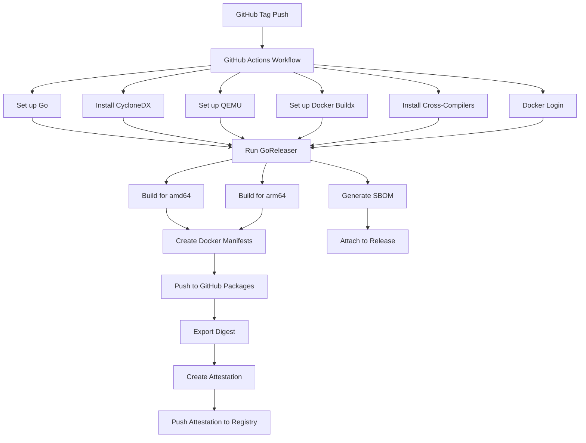

# GoReleaser Implementation Plan

This document outlines the plan for setting up GoReleaser to build Docker images for Linux amd64 and arm64 architectures, with GitHub attestations and SBOM generation, while ensuring cross-compilation works with CGO_ENABLED=1.

## Overview

We need to implement the following components:

1. Multi-architecture Docker builds (amd64 and arm64)
2. GitHub provenance attestations
3. SBOM generation
4. Cross-compilation support for CGO_ENABLED=1 (SQLite dependency)

## Implementation Steps

### 1. Update GoReleaser Configuration (Confidence: 9/10)

We'll update the `.goreleaser.yml` file to support multi-architecture Docker builds:

```yaml
before:
  hooks:
    - go mod tidy

builds:
  - id: night-routine
    main: ./cmd/night-routine
    env:
      - CGO_ENABLED=1
    goos:
      - linux
    goarch:
      - amd64
      - arm64
    ldflags:
      - -s -w
      - -X main.version={{.Version}}
      - -X main.commit={{.Commit}}
      - -X main.date={{.Date}}

dockers:
  - image_templates:
      - "ghcr.io/belphemur/night-routine:{{ .Version }}-amd64"
      - "ghcr.io/belphemur/night-routine:latest-amd64"
    use: buildx
    dockerfile: build/Dockerfile
    build_flag_templates:
      - "--platform=linux/amd64"
      - "--cache-from=type=gha,scope={{.Env.GITHUB_REF}}"
      - "--cache-to=type=gha,mode=max,scope={{.Env.GITHUB_REF}}"
      - "--label=org.opencontainers.image.created={{.Date}}"
      - "--label=org.opencontainers.image.title=night-routine"
      - "--label=org.opencontainers.image.revision={{.FullCommit}}"
      - "--label=org.opencontainers.image.version={{.Version}}"
    goarch: amd64
    goos: linux
    extra_files:
      - configs/routine.toml

  - image_templates:
      - "ghcr.io/belphemur/night-routine:{{ .Version }}-arm64"
      - "ghcr.io/belphemur/night-routine:latest-arm64"
    use: buildx
    dockerfile: build/Dockerfile
    build_flag_templates:
      - "--platform=linux/arm64"
      - "--cache-from=type=gha,scope={{.Env.GITHUB_REF}}"
      - "--cache-to=type=gha,mode=max,scope={{.Env.GITHUB_REF}}"
      - "--label=org.opencontainers.image.created={{.Date}}"
      - "--label=org.opencontainers.image.title=night-routine"
      - "--label=org.opencontainers.image.revision={{.FullCommit}}"
      - "--label=org.opencontainers.image.version={{.Version}}"
    goarch: arm64
    goos: linux
    extra_files:
      - configs/routine.toml

docker_manifests:
  - name_template: ghcr.io/belphemur/night-routine:{{ .Version }}
    image_templates:
      - ghcr.io/belphemur/night-routine:{{ .Version }}-amd64
      - ghcr.io/belphemur/night-routine:{{ .Version }}-arm64
  - name_template: ghcr.io/belphemur/night-routine:latest
    image_templates:
      - ghcr.io/belphemur/night-routine:latest-amd64
      - ghcr.io/belphemur/night-routine:latest-arm64

sboms:
  - artifacts: archive
    documents:
      - "{{ .ProjectName }}_{{ .Version }}_sbom.cdx.json"
    cmd: cyclonedx-gomod
    args:
      [
        "app",
        "-json",
        "-output",
        "$document",
        "-licenses",
        "-std",
        "-main",
        "./cmd/night-routine",
      ]
```

### 2. Update Dockerfile for Cross-Compilation (Confidence: 8/10)

We'll update the `build/Dockerfile` to better support multi-architecture builds:

```dockerfile
# Build stage
FROM --platform=$BUILDPLATFORM golang:1-alpine AS builder

ARG BUILDPLATFORM
ARG TARGETPLATFORM
ARG TARGETOS
ARG TARGETARCH

WORKDIR /workspace

# Install build dependencies
RUN apk add --no-cache build-base

# For cross-compilation with SQLite
RUN if [ "$TARGETARCH" = "arm64" ]; then \
      apk add --no-cache gcc-aarch64-linux-musl musl-dev; \
    fi

# Copy Go module manifests
COPY go.mod go.sum ./
RUN go mod download

# Copy source code
COPY . .

# Build with appropriate flags for the target architecture
RUN CGO_ENABLED=1 GOOS=$TARGETOS GOARCH=$TARGETARCH \
    go build -v -o night-routine ./cmd/night-routine

# Runtime stage
FROM --platform=$TARGETPLATFORM gcr.io/distroless/static-debian12:nonroot

WORKDIR /app

# Copy binary from builder stage
COPY --from=builder /workspace/night-routine .

# Copy default configuration
COPY configs/routine.toml /config/routine.toml

USER nonroot:nonroot

# Expose port for health checks and metrics
EXPOSE 8080

# Volume for persistent state
VOLUME ["/config"]

# Set environment variables
ENV CONFIG_FILE=/config/routine.toml

ENTRYPOINT ["/app/night-routine"]
```

### 3. Update GitHub Workflow for Attestations and SBOM (Confidence: 9/10)

We'll update the `.github/workflows/release.yml` file to include provenance attestations and SBOM generation:

```yaml
name: Release

on:
  push:
    tags:
      - "v*"

permissions:
  contents: write
  packages: write
  id-token: write # Required for attestations
  attestations: write # Required for attestations

jobs:
  release:
    name: Release
    runs-on: ubuntu-latest
    steps:
      - uses: actions/checkout@v4
        with:
          fetch-depth: 0

      - name: Set up Go
        uses: actions/setup-go@v5
        with:
          go-version: "1.24"
          cache: true

      - name: Install CycloneDX
        run: go install github.com/CycloneDX/cyclonedx-gomod/cmd/cyclonedx-gomod@latest

      - name: Set up QEMU
        uses: docker/setup-qemu-action@v3

      - name: Set up Docker Buildx
        uses: docker/setup-buildx-action@v3
        with:
          platforms: linux/amd64,linux/arm64

      - name: Install cross-compilers
        run: |
          sudo apt-get update
          sudo apt-get install -y gcc-aarch64-linux-gnu libc6-dev-arm64-cross

      - name: Docker Login
        uses: docker/login-action@v3
        with:
          registry: ghcr.io
          username: ${{ github.actor }}
          password: ${{ secrets.GITHUB_TOKEN }}

      - name: Run GoReleaser
        id: goreleaser
        uses: goreleaser/goreleaser-action@v6
        with:
          distribution: goreleaser
          version: latest
          args: release --clean
        env:
          GITHUB_TOKEN: ${{ secrets.GITHUB_TOKEN }}

      - name: Export Digest
        id: digest
        run: |
          mkdir -p /tmp/digests
          # Extract digest for amd64
          echo "digest=$(docker buildx imagetools inspect ghcr.io/belphemur/night-routine:${{ steps.goreleaser.outputs.version }}-amd64 --format "{{json .Manifest.Digest}}" | xargs)" >> $GITHUB_OUTPUT
          echo "${{ steps.goreleaser.outputs.version }}@sha256:$digest" > "/tmp/digests/${{ steps.goreleaser.outputs.version }}"

      - name: Attest
        uses: actions/attest-build-provenance@v2
        with:
          subject-name: "ghcr.io/belphemur/night-routine:${{ steps.goreleaser.outputs.version }}"
          subject-digest: ${{ steps.digest.outputs.digest }}
          push-to-registry: true
```

## Cross-Compilation Strategy for CGO with SQLite (Confidence: 8/10)

Since the application only depends on SQLite, we can use the following approach for cross-compilation:

1. Use Docker's buildx feature with QEMU for emulation
2. Install the appropriate cross-compilers in the GitHub workflow
3. Configure the Dockerfile to use the correct build flags based on the target architecture
4. Set CGO_ENABLED=1 for all builds

This approach allows us to build for both amd64 and arm64 architectures without needing to set up complex cross-compilation environments.

## Implementation Diagram



## Confidence Ratings Summary

1. Update GoReleaser Configuration: **9/10**

   - High confidence as this is a standard GoReleaser feature with good documentation.

2. Update Dockerfile for Cross-Compilation: **8/10**

   - Slightly lower confidence due to the complexity of cross-compiling CGO applications, but SQLite-only makes it more manageable.

3. Update GitHub Workflow for Attestations and SBOM: **9/10**

   - High confidence as we're following your existing pattern for attestations.

4. Cross-Compilation Strategy for CGO with SQLite: **8/10**
   - Slightly lower confidence due to potential platform-specific issues, but the approach is solid.
