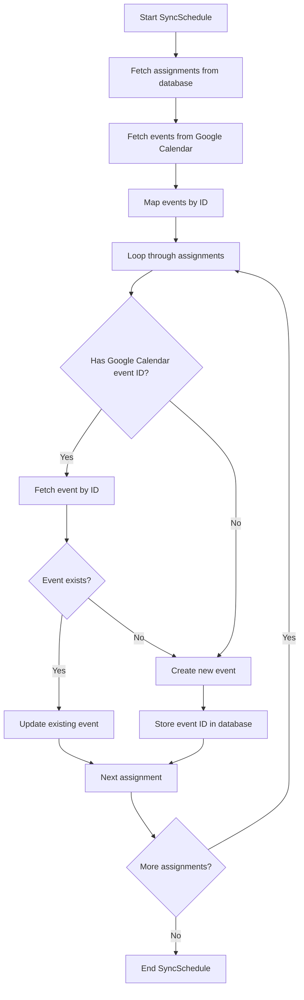
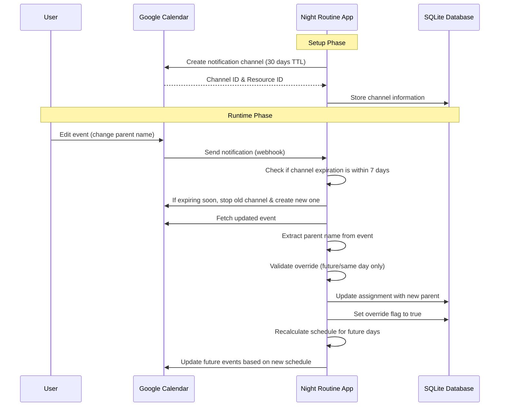

# Implementation Plan: Calendar Integration Enhancements

## Overview

This document outlines the implementation plan for two key enhancements to the Night Routine Scheduler's Google Calendar integration:

1. **Update Instead of Delete/Recreate Events**: Modify the sync process to update existing events rather than deleting and recreating them.
2. **Calendar Entry Overrides via Google Calendar**: Allow users to override parent assignments by editing events directly in Google Calendar.

## Feature 1: Update Instead of Delete/Recreate Events

### Current Behavior

Currently, the `SyncSchedule` method in `calendar.go` deletes all existing events and creates new ones during each sync operation.

### Desired Behavior

Check if there's already a Google Calendar event ID for an assignment. If there is, update the existing event; otherwise, create a new one.

### Implementation Steps



### Code Changes

1. **Modify `SyncSchedule` method in `calendar.go`**:
   - Change the event lookup logic to map events by their ID
   - Add logic to update existing events instead of deleting and recreating them
   - Ensure proper error handling for cases where events might have been deleted manually

## Feature 2: Calendar Entry Overrides via Google Calendar

### Current Behavior

Users cannot override parent assignments by editing events in Google Calendar.

### Desired Behavior

Users can edit events in Google Calendar to change the parent name, and the application will detect these changes and update the assignments accordingly.

### Additional Requirements

1. When an override is detected, update the assignment and trigger a recalculation of the schedule for the next days.
2. Only accept overrides for events/assignments in the future or on the same day. Reject overrides for past events.
3. Use the same look-ahead period as defined in the config (Schedule.LookAheadDays) for recalculation.
4. Set notification channel expiration to 30 days, but refresh it when within 7 days of expiration.
5. Update `Scheduler.GenerateSchedule` to respect overridden assignments as fixed points in time.

### Implementation Steps



### Database Changes

1. **Create a new migration for notification channels**:

```sql
CREATE TABLE IF NOT EXISTS notification_channels (
    id INTEGER PRIMARY KEY,
    channel_id TEXT NOT NULL,
    resource_id TEXT NOT NULL,
    expiration TIMESTAMP NOT NULL,
    calendar_id TEXT NOT NULL,
    created_at TIMESTAMP DEFAULT CURRENT_TIMESTAMP,
    updated_at TIMESTAMP DEFAULT CURRENT_TIMESTAMP
);

-- Create a trigger to update the updated_at column when a row is updated
CREATE TRIGGER IF NOT EXISTS notification_channels_update_trigger
AFTER UPDATE ON notification_channels
FOR EACH ROW
BEGIN
    UPDATE notification_channels SET updated_at = CURRENT_TIMESTAMP
    WHERE id = NEW.id;
END;
```

### Code Changes

1. **Add notification channel management to `TokenStore`**:

   - Add methods to save, retrieve, and manage notification channels

2. **Add webhook setup to `calendar.go`**:

   - Create a method to set up and refresh notification channels
   - Set TTL to 30 days

3. **Create webhook handler**:

   - Add a new handler to process incoming webhook notifications
   - Check if notification channel is within 7 days of expiration and refresh if needed
   - Validate the time of the override (future or same day only)
   - Update the assignment and trigger schedule recalculation

4. **Update `scheduler.go`**:

   - Modify `GenerateSchedule` to respect overridden assignments as fixed points
   - Add method to find assignments by Google Calendar event ID
   - Add method to update assignment parent and set override flag
   - Add method to recalculate schedule after an override

5. **Add methods to `tracker.go`**:
   - Add method to find assignments by Google Calendar event ID
   - Add method to update assignment parent and set override flag
   - Add method to get all overridden assignments in a date range

## Detailed Technical Implementation

### Feature 1: Update Instead of Delete/Recreate Events

Modify the `SyncSchedule` method in `calendar.go`:

```go
// SyncSchedule synchronizes the schedule with Google Calendar
func (s *Service) SyncSchedule(ctx context.Context, assignments []*scheduler.Assignment) error {
    // Get latest token in case it was refreshed
    token, err := s.tokenManager.GetValidToken(ctx)
    if err != nil {
        return fmt.Errorf("failed to get token: %w", err)
    }
    if token == nil {
        return fmt.Errorf("no valid token available")
    }

    // Get latest calendar ID in case it was changed
    calendarID, err := s.tokenStore.GetSelectedCalendar()
    if err != nil {
        return fmt.Errorf("failed to get calendar ID: %w", err)
    }
    if calendarID != "" {
        s.calendarID = calendarID
    }

    // Unique identifier for events created by this application
    const nightRoutineIdentifier = "night-routine-app-event"

    // If no assignments, nothing to sync
    if len(assignments) == 0 {
        return nil
    }

    // Find first and last date in assignments to define our date range for events
    firstDate := assignments[0].Date
    lastDate := assignments[0].Date

    for _, a := range assignments {
        if a.Date.Before(firstDate) {
            firstDate = a.Date
        }
        if a.Date.After(lastDate) {
            lastDate = a.Date
        }
    }

    // Fetch all events in the date range at once
    timeMin := firstDate.Add(-24 * time.Hour).Format(time.RFC3339)
    timeMax := lastDate.Add(24 * time.Hour).Format(time.RFC3339) // Add a day to include last date fully

    events, err := s.srv.Events.List(s.calendarID).
        TimeMin(timeMin).
        TimeMax(timeMax).
        SingleEvents(true).
        OrderBy("startTime").
        Do()
    if err != nil {
        return fmt.Errorf("failed to list events for date range: %w", err)
    }

    // Map events by ID for easy lookup
    eventsByID := make(map[string]*calendar.Event)
    for _, event := range events.Items {
        if event.Source != nil && event.Source.Title == nightRoutineIdentifier {
            eventsByID[event.Id] = event
        }
    }

    // Process assignments
    for _, assignment := range assignments {
        // Check if we already have a Google Calendar event ID for this assignment
        if assignment.GoogleCalendarEventID != "" {
            // Try to update the existing event
            existingEvent, exists := eventsByID[assignment.GoogleCalendarEventID]
            if exists {
                // Update the existing event
                existingEvent.Summary = fmt.Sprintf("[%s] 🌃👶Routine", assignment.Parent)
                existingEvent.Description = fmt.Sprintf("Night routine duty assigned to %s [%s]",
                    assignment.Parent, nightRoutineIdentifier)

                // Update the event in Google Calendar
                _, err := s.srv.Events.Update(s.calendarID, existingEvent.Id, existingEvent).Do()
                if err != nil {
                    return fmt.Errorf("failed to update event for %v: %w", assignment.Date, err)
                }

                // Remove from the map so we don't process it again
                delete(eventsByID, existingEvent.Id)
                continue
            }
            // If the event doesn't exist anymore, we'll create a new one
        }

        // Create new event with our identifier
        dateStr := assignment.Date.Format("2006-01-02")
        event := &calendar.Event{
            Summary: fmt.Sprintf("[%s] 🌃👶Routine", assignment.Parent),
            Start: &calendar.EventDateTime{
                Date: dateStr,
            },
            End: &calendar.EventDateTime{
                Date: dateStr,
            },
            Description: fmt.Sprintf("Night routine duty assigned to %s [%s]",
                assignment.Parent, nightRoutineIdentifier),
            Location:     "Home",
            Transparency: "transparent",
            Source: &calendar.EventSource{
                Title: nightRoutineIdentifier,
                Url:   s.config.App.Url,
            },
            Reminders: &calendar.EventReminders{
                UseDefault:      false,
                ForceSendFields: []string{"UseDefault"},
                Overrides: []*calendar.EventReminder{
                    {
                        Method:  "popup",
                        Minutes: 4 * 60, // The day before at 8 PM
                    },
                },
            },
        }

        // Create the event in Google Calendar
        createdEvent, err := s.srv.Events.Insert(s.calendarID, event).Do()
        if err != nil {
            return fmt.Errorf("failed to create event for %v: %w", assignment.Date, err)
        }

        // Update the assignment with the Google Calendar event ID
        if err := s.scheduler.UpdateGoogleCalendarEventID(assignment, createdEvent.Id); err != nil {
            // Log error but continue; this isn't fatal
            fmt.Printf("Warning: Failed to update assignment with Google Calendar event ID: %v\n", err)
        }
    }

    return nil
}
```

### Feature 2: Calendar Entry Overrides via Google Calendar

1. **Add notification channel management to `TokenStore`**:

```go
// NotificationChannel represents a Google Calendar notification channel
type NotificationChannel struct {
    ID         int64
    ChannelID  string
    ResourceID string
    CalendarID string
    Expiration time.Time
    CreatedAt  time.Time
    UpdatedAt  time.Time
}

// SaveNotificationChannel saves a notification channel
func (s *TokenStore) SaveNotificationChannel(channelID, resourceID, calendarID string, expiration time.Time) error {
    _, err := s.db.Exec(`
    INSERT OR REPLACE INTO notification_channels (channel_id, resource_id, calendar_id, expiration)
    VALUES (?, ?, ?, ?)`, channelID, resourceID, calendarID, expiration.Format(time.RFC3339))
    if err != nil {
        return fmt.Errorf("failed to save notification channel: %w", err)
    }

    return nil
}

// GetNotificationChannel retrieves the notification channel for a calendar
func (s *TokenStore) GetNotificationChannel(calendarID string) (*NotificationChannel, error) {
    row := s.db.QueryRow(`
    SELECT id, channel_id, resource_id, calendar_id, expiration, created_at, updated_at
    FROM notification_channels
    WHERE calendar_id = ?
    ORDER BY created_at DESC
    LIMIT 1
    `, calendarID)

    var nc NotificationChannel
    var expirationStr, createdAtStr, updatedAtStr string

    err := row.Scan(
        &nc.ID,
        &nc.ChannelID,
        &nc.ResourceID,
        &nc.CalendarID,
        &expirationStr,
        &createdAtStr,
        &updatedAtStr,
    )

    if err != nil {
        if err == sql.ErrNoRows {
            return nil, nil // No channel found, which is ok
        }
        return nil, fmt.Errorf("failed to scan notification channel: %w", err)
    }

    expiration, err := time.Parse(time.RFC3339, expirationStr)
    if err != nil {
        return nil, fmt.Errorf("failed to parse expiration: %w", err)
    }
    nc.Expiration = expiration

    createdAt, err := time.Parse("2006-01-02 15:04:05", createdAtStr)
    if err == nil {
        nc.CreatedAt = createdAt
    }

    updatedAt, err := time.Parse("2006-01-02 15:04:05", updatedAtStr)
    if err == nil {
        nc.UpdatedAt = updatedAt
    }

    return &nc, nil
}

// GetNotificationChannelByID retrieves a notification channel by its ID
func (s *TokenStore) GetNotificationChannelByID(channelID string) (*NotificationChannel, error) {
    row := s.db.QueryRow(`
    SELECT id, channel_id, resource_id, calendar_id, expiration, created_at, updated_at
    FROM notification_channels
    WHERE channel_id = ?
    `, channelID)

    var nc NotificationChannel
    var expirationStr, createdAtStr, updatedAtStr string

    err := row.Scan(
        &nc.ID,
        &nc.ChannelID,
        &nc.ResourceID,
        &nc.CalendarID,
        &expirationStr,
        &createdAtStr,
        &updatedAtStr,
    )

    if err != nil {
        if err == sql.ErrNoRows {
            return nil, nil // No channel found, which is ok
        }
        return nil, fmt.Errorf("failed to scan notification channel: %w", err)
    }

    expiration, err := time.Parse(time.RFC3339, expirationStr)
    if err != nil {
        return nil, fmt.Errorf("failed to parse expiration: %w", err)
    }
    nc.Expiration = expiration

    createdAt, err := time.Parse("2006-01-02 15:04:05", createdAtStr)
    if err == nil {
        nc.CreatedAt = createdAt
    }

    updatedAt, err := time.Parse("2006-01-02 15:04:05", updatedAtStr)
    if err == nil {
        nc.UpdatedAt = updatedAt
    }

    return &nc, nil
}

// DeleteNotificationChannel deletes a notification channel by its ID
func (s *TokenStore) DeleteNotificationChannel(channelID string) error {
    _, err := s.db.Exec(`
    DELETE FROM notification_channels
    WHERE channel_id = ?
    `, channelID)
    if err != nil {
        return fmt.Errorf("failed to delete notification channel: %w", err)
    }

    return nil
}
```

2. **Add webhook setup to `calendar.go`**:

```go
// SetupNotificationChannel creates or refreshes a notification channel for calendar events
func (s *Service) SetupNotificationChannel(ctx context.Context) error {
    // Check if we already have an active channel
    channel, err := s.tokenStore.GetNotificationChannel(s.calendarID)
    if err != nil {
        return fmt.Errorf("failed to check existing notification channel: %w", err)
    }

    // If channel exists and is not close to expiration, reuse it
    if channel != nil && time.Until(channel.Expiration) > 7*24*time.Hour {
        return nil
    }

    // If we have an existing channel that's close to expiration, stop it first
    if channel != nil {
        if err := s.StopNotificationChannel(ctx, channel.ChannelID, channel.ResourceID); err != nil {
            log.Printf("Warning: Failed to stop existing notification channel: %v", err)
            // Continue anyway to create a new channel
        }
    }

    // Create a new notification channel
    webhookURL := fmt.Sprintf("%s/api/webhook/calendar", s.config.App.Url)
    channelID := uuid.New().String()

    newChannel := &calendar.Channel{
        Id:      channelID,
        Type:    "web_hook",
        Address: webhookURL,
        Params: map[string]string{
            "ttl": "2592000", // 30 days in seconds
        },
    }

    // Register the channel with Google Calendar
    createdChannel, err := s.srv.Events.Watch(s.calendarID, newChannel).Do()
    if err != nil {
        return fmt.Errorf("failed to create notification channel: %w", err)
    }

    // Store the channel information in the database
    expiration := time.Now().Add(30 * 24 * time.Hour) // 30 days
    if createdChannel.Expiration > 0 {
        expiration = time.Unix(createdChannel.Expiration/1000, 0)
    }

    err = s.tokenStore.SaveNotificationChannel(createdChannel.Id, createdChannel.ResourceId, s.calendarID, expiration)
    if err != nil {
        return fmt.Errorf("failed to save notification channel: %w", err)
    }

    return nil
}

// StopNotificationChannel stops an existing notification channel
func (s *Service) StopNotificationChannel(ctx context.Context, channelID, resourceID string) error {
    stopChannel := &calendar.Channel{
        Id:         channelID,
        ResourceId: resourceID,
    }

    err := s.srv.Channels.Stop(stopChannel).Do()
    if err != nil {
        return fmt.Errorf("failed to stop notification channel: %w", err)
    }

    // Remove from database
    if err := s.tokenStore.DeleteNotificationChannel(channelID); err != nil {
        return fmt.Errorf("failed to delete notification channel from database: %w", err)
    }

    return nil
}
```

3. **Create webhook handler**:

```go
// WebhookHandler handles incoming webhook notifications
type WebhookHandler struct {
    *BaseHandler
    CalendarService *calendar.Service
    Scheduler       *scheduler.Scheduler
    Config          *config.Config
}

// RegisterRoutes registers webhook related routes
func (h *WebhookHandler) RegisterRoutes() {
    http.HandleFunc("/api/webhook/calendar", h.handleCalendarWebhook)
}

// handleCalendarWebhook processes incoming calendar notifications
func (h *WebhookHandler) handleCalendarWebhook(w http.ResponseWriter, r *http.Request) {
    // Validate the request
    channelID := r.Header.Get("X-Goog-Channel-ID")
    resourceID := r.Header.Get("X-Goog-Resource-ID")

    // Verify the channel ID and resource ID
    channel, err := h.TokenStore.GetNotificationChannelByID(channelID)
    if err != nil || channel == nil || channel.ResourceID != resourceID {
        http.Error(w, "Invalid notification channel", http.StatusBadRequest)
        return
    }

    // Check if the channel is close to expiration (within 7 days)
    if time.Until(channel.Expiration) < 7*24*time.Hour {
        // Create a new calendar service
        calendarSvc, err := calendar.New(r.Context(), h.CalendarService, h.TokenStore, h.Scheduler)
        if err != nil {
            log.Printf("Warning: Failed to create calendar service for channel refresh: %v", err)
        } else {
            // Refresh the notification channel
            if err := calendarSvc.SetupNotificationChannel(r.Context()); err != nil {
                log.Printf("Warning: Failed to refresh notification channel: %v", err)
            } else {
                log.Printf("Successfully refreshed notification channel that was close to expiration")
            }
        }
    }

    // Process the notification
    if r.Header.Get("X-Goog-Resource-State") == "sync" {
        // This is just a sync message, acknowledge it
        w.WriteHeader(http.StatusOK)
        return
    }

    // This is an actual change notification
    // Process the event changes
    if err := h.processEventChanges(r.Context(), channel.CalendarID); err != nil {
        log.Printf("Error processing event changes: %v", err)
        http.Error(w, "Failed to process event changes", http.StatusInternalServerError)
        return
    }

    w.WriteHeader(http.StatusOK)
}

// processEventChanges fetches recent changes and updates assignments
func (h *WebhookHandler) processEventChanges(ctx context.Context, calendarID string) error {
    // Get the latest token
    token, err := h.TokenStore.GetToken()
    if err != nil {
        return fmt.Errorf("failed to get token: %w", err)
    }

    // Create a calendar client
    client := h.OAuthConfig.Client(ctx, token)
    calendarService, err := calendar.NewService(ctx, option.WithHTTPClient(client))
    if err != nil {
        return fmt.Errorf("failed to create calendar service: %w", err)
    }

    // Get events that were recently updated
    timeMin := time.Now().Add(-24 * time.Hour).Format(time.RFC3339)
    events, err := calendarService.Events.List(calendarID).
        UpdatedMin(timeMin).
        SingleEvents(true).
        OrderBy("updated").
        Do()
    if err != nil {
        return fmt.Errorf("failed to list updated events: %w", err)
    }

    // Process each event
    for _, event := range events.Items {
        // Check if this is one of our events
        if event.Source == nil || event.Source.Title != "night-routine-app-event" {
            continue
        }

        // Extract the parent name from the event summary
        // Format: "[Parent] 🌃👶Routine"
        parentName := extractParentName(event.Summary)
        if parentName == "" {
            continue
        }

        // Find the assignment by Google Calendar event ID
        assignment, err := h.Scheduler.GetAssignmentByGoogleCalendarEventID(event.Id)
        if err != nil {
            log.Printf("Error finding assignment for event %s: %v", event.Id, err)
            continue
        }

        // If assignment not found or parent name hasn't changed, skip
        if assignment == nil || assignment.Parent == parentName {
            continue
        }

        // Check if the assignment is in the future or today
        today := time.Now().Truncate(24 * time.Hour)
        if assignment.Date.Before(today) {
            log.Printf("Rejecting override for past assignment on %s", assignment.Date.Format("2006-01-02"))
            continue
        }

        // Update the assignment with the new parent name and set override flag
        if err := h.Scheduler.UpdateAssignmentParent(assignment.ID, parentName, true); err != nil {
            log.Printf("Error updating assignment %d: %v", assignment.ID, err)
            continue
        }

        log.Printf("Updated assignment %d from %s to %s (override)",
            assignment.ID, assignment.Parent, parentName)

        // Recalculate the schedule for future days
        if err := h.recalculateSchedule(ctx, assignment.Date, calendarID); err != nil {
            log.Printf("Error recalculating schedule: %v", err)
        }
    }

    return nil
}

// recalculateSchedule regenerates the schedule from the given date
func (h *WebhookHandler) recalculateSchedule(ctx context.Context, fromDate time.Time, calendarID string) error {
    // Use the same look-ahead period as defined in the config
    lookAheadDays := h.Config.Schedule.LookAheadDays

    // Calculate the end date
    endDate := fromDate.AddDate(0, 0, lookAheadDays)

    // Generate a new schedule
    assignments, err := h.Scheduler.GenerateSchedule(fromDate, endDate)
    if err != nil {
        return fmt.Errorf("failed to generate schedule: %w", err)
    }

    // Sync the new schedule with Google Calendar
    calendarSvc, err := calendar.New(ctx, h.CalendarService, h.TokenStore, h.Scheduler)
    if err != nil {
        return fmt.Errorf("failed to create calendar service: %w", err)
    }

    if err := calendarSvc.SyncSchedule(ctx, assignments); err != nil {
        return fmt.Errorf("failed to sync schedule: %w", err)
    }

    return nil
}

// extractParentName extracts the parent name from the event summary
func extractParentName(summary string) string {
    // Format: "[Parent] 🌃👶Routine"
    if len(summary) < 3 || !strings.HasPrefix(summary, "[") {
        return ""
    }

    endBracket := strings.Index(summary, "]")
    if endBracket <= 1 {
        return ""
    }

    return summary[1:endBracket]
}
```

4. **Update `scheduler.go`**:

```go
// GenerateSchedule creates a schedule for the specified date range
// This updated version respects overridden assignments as fixed points
func (s *Scheduler) GenerateSchedule(start, end time.Time) ([]*Assignment, error) {
    var schedule []*Assignment]
    current := start

    // Get all existing assignments in the date range, including overrides
    existingAssignments, err := s.tracker.GetAssignmentsInRange(start, end)
    if err != nil {
        return nil, fmt.Errorf("failed to get existing assignments: %w", err)
    }

    // Map assignments by date for easy lookup
    assignmentsByDate := make(map[string]*fairness.Assignment)
    for _, a := range existingAssignments {
        dateStr := a.Date.Format("2006-01-02")
        assignmentsByDate[dateStr] = a
    }

    // Process each day in the range
    for !current.After(end) {
        dateStr := current.Format("2006-01-02")

        // Check if there's an existing assignment for this date
        if existing, ok := assignmentsByDate[dateStr]; ok {
            // Convert to scheduler assignment
            assignment := &Assignment{
                ID:                    existing.ID,
                Date:                  existing.Date,
                Parent:                existing.Parent,
                GoogleCalendarEventID: existing.GoogleCalendarEventID,
            }
            schedule = append(schedule, assignment)
        } else {
            // No existing assignment, create a new one
            assignment, err := s.assignForDate(current)
            if err != nil {
                return nil, fmt.Errorf("failed to assign for date %v: %w", current, err)
            }
            schedule = append(schedule, assignment)
        }

        current = current.AddDate(0, 0, 1)
    }

    return schedule, nil
}

// assignForDate determines who should do the night routine on a specific date and records it
// This method now takes into account overridden assignments when determining fairness
func (s *Scheduler) assignForDate(date time.Time) (*Assignment, error) {
    // First check if there's already an assignment for this date
    existingAssignment, err := s.tracker.GetAssignmentByDate(date)
    if err != nil {
        return nil, fmt.Errorf("failed to check existing assignment: %w", err)
    }

    // If there's already an assignment for this date, use it
    if existingAssignment != nil {
        return &Assignment{
            ID:                    existingAssignment.ID,
            Date:                  existingAssignment.Date,
            Parent:                existingAssignment.Parent,
            GoogleCalendarEventID: existingAssignment.GoogleCalendarEventID,
        }, nil
    }

    // Get last assignments to ensure fairness
    lastAssignments, err := s.tracker.GetLastAssignments(5)
    if err != nil {
        return nil, fmt.Errorf("failed to get last assignments: %w", err)
    }

    // Get parent stats for balanced distribution
    stats, err := s.tracker.GetParentStats()
    if err != nil {
        return nil, fmt.Errorf("failed to get parent stats: %w", err)
    }

    // Determine the next parent to assign based on fairness rules
    parent, err := s.determineParentForDate(date, lastAssignments, stats)
    if err != nil {
        return nil, err
    }

    // Record the assignment in the database
    trackerAssignment, err := s.tracker.RecordAssignment(parent, date)
    if err != nil {
        return nil, fmt.Errorf("failed to record assignment: %w", err)
    }

    // Convert to scheduler assignment
    return &Assignment{
        ID:                    trackerAssignment.ID,
        Date:                  trackerAssignment.Date,
        Parent:                trackerAssignment.Parent,
        GoogleCalendarEventID: trackerAssignment.GoogleCalendarEventID,
    }, nil
}

// GetAssignmentByGoogleCalendarEventID finds an assignment by its Google Calendar event ID
func (s *Scheduler) GetAssignmentByGoogleCalendarEventID(eventID string) (*Assignment, error) {
    assignment, err := s.tracker.GetAssignmentByGoogleCalendarEventID(eventID)
    if err != nil {
        return nil, fmt.Errorf("failed to get assignment by Google Calendar event ID: %w", err)
    }

    if assignment == nil {
        return nil, nil
    }

    return &Assignment{
        ID:                    assignment.ID,
        Date:                  assignment.Date,
        Parent:                assignment.Parent,
        GoogleCalendarEventID: assignment.GoogleCalendarEventID,
    }, nil
}

// UpdateAssignmentParent updates the parent for an assignment and sets the override flag
func (s *Scheduler) UpdateAssignmentParent(id int64, parent string, override bool) error {
    err := s.tracker.UpdateAssignmentParent(id, parent, override)
    if err != nil {
        return fmt.Errorf("failed to update assignment parent: %w", err)
    }

    return nil
}
```

5. **Add methods to `tracker.go`**:

```go
// GetAssignmentsInRange retrieves all assignments in a date range
func (t *Tracker) GetAssignmentsInRange(start, end time.Time) ([]*Assignment, error) {
    startStr := start.Format("2006-01-02")
    endStr := end.Format("2006-01-02")

    rows, err := t.db.Query(`
```
