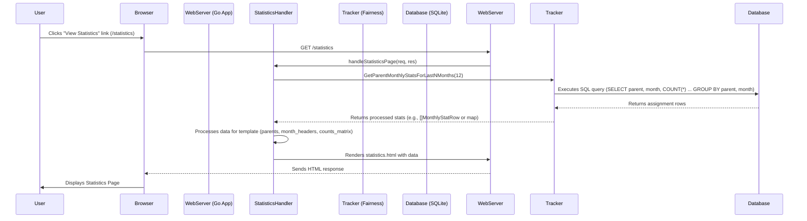

# Project Plan: Add Statistics Page

**Goal:** Create a new page at `/statistics` that displays a table of night routine completions per parent, grouped by month, for the last 12 months. Add a link to this page on the home page.

**Key Decisions based on User Feedback:**

- **Data Scope:** Last 12 months.
- **Table Structure:** Parents as rows, Months (YYYY-MM) as columns.
- **URL:** `/statistics`
- **No Data Behavior:** Show an empty table structure.
- **Parent Names:** Dynamically determined from data.

---

### Phase 1: Backend Implementation

**Step 1: Enhance Database Interaction (`internal/fairness/tracker.go`)**

1.  **Define Data Structures for Statistics:**
    - Create a struct to hold the raw query result, e.g.:
      ```go
      type MonthlyStatRow struct {
          ParentName string
          MonthYear  string // "YYYY-MM"
          Count      int
      }
      ```
    - Define a struct for the processed data to be passed to the handler/template:
      ```go
      type ParentMonthlyStats struct {
          ParentName   string
          MonthlyCounts map[string]int // Key: "YYYY-MM", Value: Count
      }
      ```
2.  **Create New Public Function: `GetParentMonthlyStatsForLastNMonths(months int)`**
    - **Purpose:** Fetch and aggregate assignment counts per parent per month for the last `n` months.
    - **SQL Query:**
      - Select `parent_name`, `strftime('%Y-%m', assignment_date)` as `month_year`, and `COUNT(*)` as `count`.
      - From the `assignments` table.
      - Filter for `assignment_date` within the last `n` months from the current date.
      - Group by `parent_name` and `month_year`.
      - Order by `parent_name` and `month_year`.
    - **Logic:**
      - Execute the SQL query.
      - Iterate through the results, populating a list of `MonthlyStatRow`.
    - **Return Value:** `([]MonthlyStatRow, error)` or directly process into a more structured format if preferred (see Step 2.3 below).

**Step 2: Create Statistics Handler (`internal/handlers/statistics_handler.go`)**

1.  **Create File:** `internal/handlers/statistics_handler.go`
2.  **Define `StatisticsHandler` Struct:**

    ```go
    package handlers

    import (
        // ... other necessary imports
        "github.com/belphemur/night-routine/internal/fairness"
    )

    type StatisticsHandler struct {
        *BaseHandler
        // Tracker is already part of BaseHandler, so it can be accessed via h.Tracker
    }

    func NewStatisticsHandler(baseHandler *BaseHandler) *StatisticsHandler {
        return &StatisticsHandler{
            BaseHandler: baseHandler,
        }
    }
    ```

3.  **Define `StatisticsPageData` Struct:**
    ```go
    type StatisticsPageData struct {
        IsAuthenticated bool
        ErrorMessage    string
        ParentsStats    []fairness.ParentMonthlyStats // Or a more tailored structure
        MonthHeaders    []string                      // Sorted list of "YYYY-MM" for table columns
    }
    ```
4.  **Implement `handleStatisticsPage(w http.ResponseWriter, r *http.Request)`:**
    - Check authentication status (similar to `home_handler.go`). If not authenticated, redirect or show an error.
    - Call `h.Tracker.GetParentMonthlyStatsForLastNMonths(12)`.
    - **Process Data for Template:**
      - Transform the raw `MonthlyStatRow` data into a more usable format for the template. This involves:
        - Creating a list of unique parent names (sorted alphabetically).
        - Creating a list of unique month-year strings for the last 12 months (sorted chronologically, e.g., "2023-06", "2023-07", ..., "2024-05"). These will be the table headers.
        - Populating `ParentsStats`: For each parent, create a map of their counts for each month in `MonthHeaders`. If a parent has no count for a specific month, it should default to 0.
    - Populate `StatisticsPageData`.
    - Render the `statistics.html` template: `h.RenderTemplate(w, "statistics.html", data)`.
5.  **Implement `RegisterRoutes()` for `StatisticsHandler`:**
    ```go
    func (h *StatisticsHandler) RegisterRoutes() {
        http.HandleFunc("/statistics", h.handleStatisticsPage)
    }
    ```

### Phase 2: Frontend Implementation

**Step 3: Create Statistics Template (`internal/handlers/templates/statistics.html`)**

1.  **Create File:** `internal/handlers/templates/statistics.html`
2.  **HTML Structure:**
    - Basic HTML boilerplate (head, title "Night Routine - Statistics", body).
    - Include basic styling, possibly linking to a shared CSS file if one exists or embedding simple styles.
    - Display `ErrorMessage` if present.
    - If `IsAuthenticated`:
      - Page Title: "Monthly Statistics (Last 12 Months)"
      - **Table Structure:**
        - `<table>`
        - `<thead>`:
          - `<tr>`:
            - `<th>Parent</th>`
            - `{{range .MonthHeaders}}<th>{{.}}</th>{{end}}` (Loop through sorted month headers)
        - `<tbody>`:
          - `{{range .ParentsStats}}` (Loop through each parent's stats)
            - `<tr>`
              - `<td>{{.ParentName}}</td>`
              - `{{range $.MonthHeaders}}` (Loop through month headers again for alignment)
                - `<td>{{index .MonthlyCounts .}}</td>` (Access count for current parent and month header. Handle missing keys gracefully, defaulting to 0)
              - `{{end}}`
            - `</tr>`
          - `{{else}}` (If `ParentsStats` is empty)
            - `<tr><td colspan="{{add (len .MonthHeaders) 1}}">No statistics data available.</td></tr>` (Render an empty table row spanning all columns)
          - `{{end}}`
    - Link back to Home page.

**Step 4: Add Link to Home Page (`internal/handlers/templates/home.html`)**

1.  **Modify `internal/handlers/templates/home.html`:**
    - Locate the section where "Change Calendar" and "Sync Now" links appear (around line 233-236).
    - Add a new link:
      ```html
      <a href="/statistics" class="button">View Statistics</a>
      ```
    - This link should only be visible if `{{if .IsAuthenticated}}` and `{{if .CalendarID}}` conditions are met.

### Phase 3: Application Wiring & Finalization

**Step 5: Update Main Application (`cmd/night-routine/main.go`)**

1.  **Import `StatisticsHandler`**.
2.  **Initialize `StatisticsHandler`:**
    ```go
    // ... after baseHandler is initialized
    statsHandler := handlers.NewStatisticsHandler(baseHandler)
    statsHandler.RegisterRoutes()
    ```
    (Ensure `baseHandler` which contains the `Tracker` is passed correctly).

**Step 6: Ensure Template Parsing (`internal/handlers/base_handler.go`)**

1.  Verify that the `template.ParseFS` call in `NewBaseHandler` uses a glob pattern like `templates/*.html` (which it currently does: `template.New("").ParseFS(templateFS, "templates/*.html")`). This will automatically include the new `statistics.html` template. No change should be needed here if the pattern is already correct.

---

### Diagram: Data Flow for Statistics Page



---
