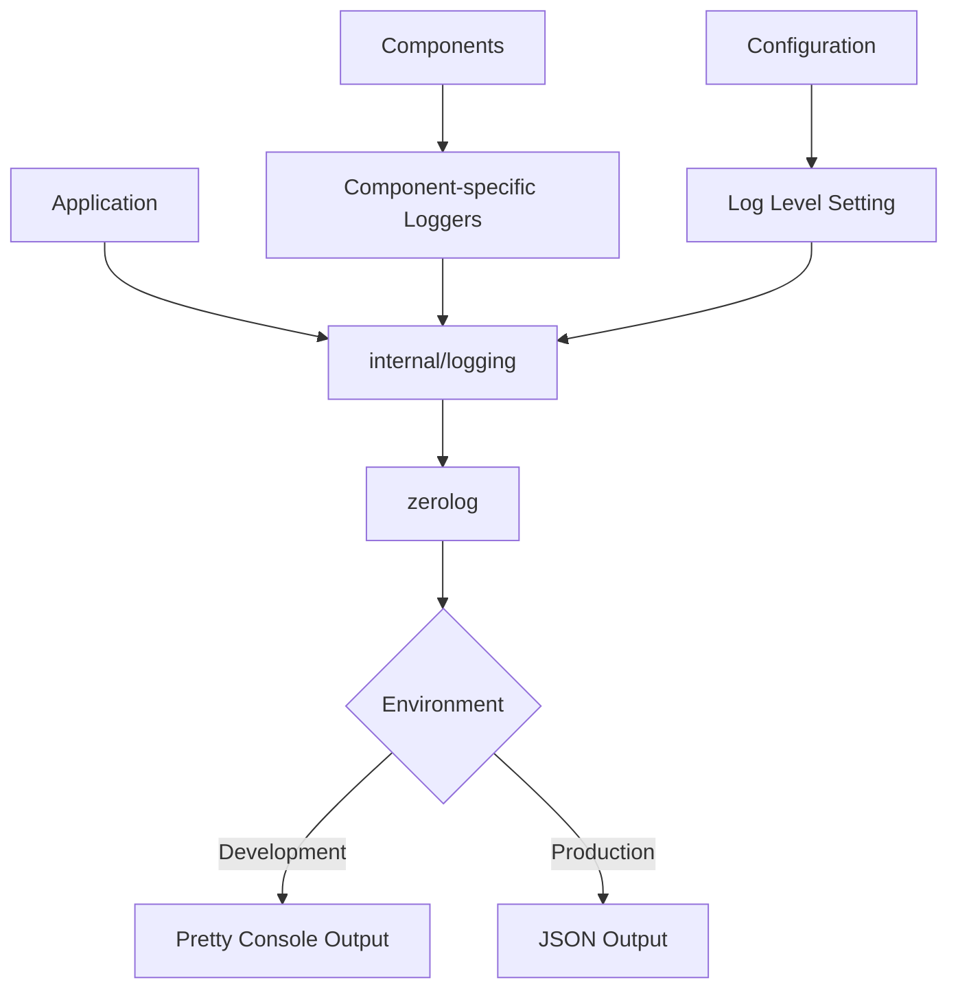

# Refactoring Plan: Migrating to Zerolog for Structured Logging

After analyzing the codebase and researching zerolog, I've created a comprehensive plan to refactor the logging system in the night-routine project. This plan will guide the migration from the standard Go `log` package to zerolog for structured logging.

## Current Logging Implementation

The current implementation has the following characteristics:

1. Uses the standard Go `log` package for most logging operations
2. Some instances of `fmt.Printf` are used for logging in certain files
3. No structured logging or consistent log levels
4. Logging is scattered throughout the codebase without centralized configuration
5. No contextual information is consistently added to log entries

## Benefits of Migrating to Zerolog

1. **Structured JSON Logging**: All logs will be in JSON format, making them easier to parse and analyze
2. **Log Levels**: Proper log levels (trace, debug, info, warn, error, fatal, panic) for better filtering
3. **Zero Allocation**: Better performance with zero allocation design
4. **Contextual Logging**: Ability to add context to logs with key-value pairs
5. **Pretty Logging**: Human-readable output for development environments
6. **Sub-loggers**: Component-specific loggers with pre-defined context
7. **Error Handling**: Better error logging with optional stack traces

## Implementation Plan

### 1. Create a Centralized Logging Package

Create a new package `internal/logging` to centralize logging configuration and provide helper functions.

```go
// internal/logging/logger.go
package logging

import (
    "io"
    "os"
    "time"

    "github.com/rs/zerolog"
    "github.com/rs/zerolog/log"
)

// Initialize sets up the global logger with the specified configuration
func Initialize(isDevelopment bool) {
    // Set global time field format
    zerolog.TimeFieldFormat = time.RFC3339

    // Configure output writer based on environment
    var output io.Writer = os.Stdout
    if isDevelopment {
        // Use pretty console writer for development
        output = zerolog.ConsoleWriter{
            Out:        os.Stdout,
            TimeFormat: "15:04:05",
        }
    }

    // Set global logger
    log.Logger = zerolog.New(output).
        With().
        Timestamp().
        Caller().
        Logger()

    // Set default log level
    zerolog.SetGlobalLevel(zerolog.InfoLevel)
    if isDevelopment {
        zerolog.SetGlobalLevel(zerolog.DebugLevel)
    }
}

// GetLogger returns a logger with the component field set
func GetLogger(component string) zerolog.Logger {
    return log.With().Str("component", component).Logger()
}

// SetLogLevel sets the global log level
func SetLogLevel(level string) {
    switch level {
    case "trace":
        zerolog.SetGlobalLevel(zerolog.TraceLevel)
    case "debug":
        zerolog.SetGlobalLevel(zerolog.DebugLevel)
    case "info":
        zerolog.SetGlobalLevel(zerolog.InfoLevel)
    case "warn":
        zerolog.SetGlobalLevel(zerolog.WarnLevel)
    case "error":
        zerolog.SetGlobalLevel(zerolog.ErrorLevel)
    case "fatal":
        zerolog.SetGlobalLevel(zerolog.FatalLevel)
    case "panic":
        zerolog.SetGlobalLevel(zerolog.PanicLevel)
    default:
        zerolog.SetGlobalLevel(zerolog.InfoLevel)
    }
}
```

### 2. Update Configuration to Support Log Level Setting

Update the configuration to include log level settings:

```go
// internal/config/config.go
// Add to ServiceConfig struct
type ServiceConfig struct {
    StateFile string `toml:"state_file"`
    LogLevel  string `toml:"log_level"` // New field for log level
}
```

Update the configuration file template to include the log level:

```toml
# configs/routine.toml
[service]
state_file = "data/night-routine.db"
log_level = "info"  # Possible values: trace, debug, info, warn, error, fatal, panic
```

### 3. Initialize Logging in Main Function

Update the main function to initialize the logging system:

```go
// cmd/night-routine/main.go
func main() {
    // Determine if we're in development mode
    isDev := os.Getenv("ENV") != "production"

    // Initialize logging
    logging.Initialize(isDev)

    // Get a logger for the main component
    logger := logging.GetLogger("main")

    logger.Info().
        Str("version", version).
        Str("commit", commit).
        Str("build_date", date).
        Msg("Starting Night Routine Scheduler")

    // Rest of the main function...
}

func run(ctx context.Context) error {
    // Get logger for the run function
    logger := logging.GetLogger("main")

    // Get config file path from environment or use default
    configPath := os.Getenv("CONFIG_FILE")
    if configPath == "" {
        configPath = "configs/routine.toml"
    }

    // Load configuration
    cfg, err := config.Load(configPath)
    if err != nil {
        return err
    }

    // Set log level from configuration
    logging.SetLogLevel(cfg.Service.LogLevel)

    // Rest of the run function...
}
```

### 4. Replace Log Statements Throughout the Codebase

For each file that uses logging, replace the standard log package with zerolog. Here's the approach:

1. Add import for zerolog: `"github.com/rs/zerolog/log"` or `"github.com/belphemur/night-routine/internal/logging"`
2. Replace `log.Printf` with appropriate zerolog methods
3. Replace `log.Fatalf` with `log.Fatal().Msg()` or `log.Fatal().Err(err).Msg()`
4. Replace `fmt.Printf` logging with zerolog methods

Example transformations:

```go
// Before
log.Printf("Starting Night Routine Scheduler v%s (%s) built at %s", version, commit, date)

// After
log.Info().
    Str("version", version).
    Str("commit", commit).
    Str("build_date", date).
    Msg("Starting Night Routine Scheduler")

// Before
log.Printf("Failed to initialize calendar service: %v", err)

// After
log.Error().
    Err(err).
    Msg("Failed to initialize calendar service")

// Before
log.Fatalf("Error: %v", err)

// After
log.Fatal().
    Err(err).
    Msg("Fatal error occurred")
```

### 5. Create Component-Specific Loggers

For each major component or package, create a component-specific logger:

```go
// internal/calendar/calendar.go
package calendar

import (
    "github.com/rs/zerolog"
    "github.com/belphemur/night-routine/internal/logging"
)

// Service handles Google Calendar operations
type Service struct {
    // existing fields...
    logger zerolog.Logger
}

// New creates a new calendar service
func New(cfg *config.Config, tokenStore *database.TokenStore, scheduler *scheduler.Scheduler, tokenManager *token.TokenManager) *Service {
    return &Service{
        // existing fields...
        logger: logging.GetLogger("calendar"),
    }
}

// Example method using the logger
func (s *Service) SyncSchedule(ctx context.Context, assignments []*scheduler.Assignment) error {
    if !s.initialized || s.srv == nil {
        return fmt.Errorf("calendar service not initialized - authentication required")
    }

    s.logger.Debug().
        Int("assignments_count", len(assignments)).
        Msg("Syncing schedule with Google Calendar")

    // Rest of the method...

    s.logger.Info().
        Int("assignments_count", len(assignments)).
        Msg("Successfully synced schedule with Google Calendar")

    return nil
}
```

### 6. Add Contextual Information to Logs

Enhance logs with contextual information to make them more useful:

```go
// Example in webhook handler
func (h *WebhookHandler) handleCalendarWebhook(w http.ResponseWriter, r *http.Request) {
    logger := logging.GetLogger("webhook")

    // Add request context to logger
    logger = logger.With().
        Str("channel_id", r.Header.Get("X-Goog-Channel-ID")).
        Str("resource_id", r.Header.Get("X-Goog-Resource-ID")).
        Str("resource_state", r.Header.Get("X-Goog-Resource-State")).
        Logger()

    // Validate the request
    channelID := r.Header.Get("X-Goog-Channel-ID")
    resourceID := r.Header.Get("X-Goog-Resource-ID")

    // Verify the channel ID and resource ID
    channel, err := h.TokenStore.GetNotificationChannelByID(channelID)
    if err != nil || channel == nil || channel.ResourceID != resourceID {
        logger.Warn().
            Err(err).
            Msg("Invalid notification channel")
        http.Error(w, "Invalid notification channel", http.StatusBadRequest)
        return
    }

    // Rest of the method...
}
```

### 7. Implement Error Logging with Stack Traces

For error logging, add stack traces to help with debugging:

```go
// Add to go.mod
// github.com/pkg/errors v0.9.1
// github.com/rs/zerolog/pkgerrors

// internal/logging/logger.go
import (
    "github.com/rs/zerolog/pkgerrors"
)

func Initialize(isDevelopment bool) {
    // Set stack trace marshaler
    zerolog.ErrorStackMarshaler = pkgerrors.MarshalStack

    // Rest of the initialization...
}

// Example usage
import (
    "github.com/pkg/errors"
)

func someFunction() error {
    err := someOperation()
    if err != nil {
        return errors.Wrap(err, "failed to perform operation")
    }
    return nil
}

// When logging the error
if err := someFunction(); err != nil {
    log.Error().
        Stack().  // Include stack trace
        Err(err).
        Msg("Operation failed")
}
```

## Migration Strategy

To ensure a smooth transition, we'll follow these steps:

1. Add zerolog to dependencies
2. Create the logging package
3. Update the configuration
4. Implement logging initialization in main
5. Refactor one component at a time, starting with the most critical ones:
   - Main package
   - Calendar service
   - Webhook handler
   - Other handlers
   - Scheduler
   - Fairness tracker
   - Database
6. Test each component after refactoring
7. Update documentation

## Testing Plan

1. Verify that all log messages are properly formatted
2. Test different log levels to ensure they work as expected
3. Ensure contextual information is correctly added to logs
4. Test error logging with stack traces
5. Verify that pretty logging works in development mode
6. Test log level configuration

## Rollback Plan

If issues arise during the migration:

1. Keep both logging systems in parallel initially
2. Add a feature flag to switch between them
3. If major issues are encountered, revert to the standard log package

## Documentation Updates

1. Update README.md with information about the new logging system
2. Document available log levels and their usage
3. Provide examples of how to use the logging package
4. Update architecture documentation to reflect the new logging design

## Diagram: Logging Architecture



## Timeline

1. Setup and initial implementation: 1 day
2. Refactoring main components: 2 days
3. Refactoring remaining components: 1 day
4. Testing and documentation: 1 day

Total estimated time: 5 days
